# Additional Data

## Diagrams

Bellow are Visuals that depict the data processing workflow, master list structures, Pentaho integration Work flow and relationships between datasets.

* **Final Structure of main Tables:**

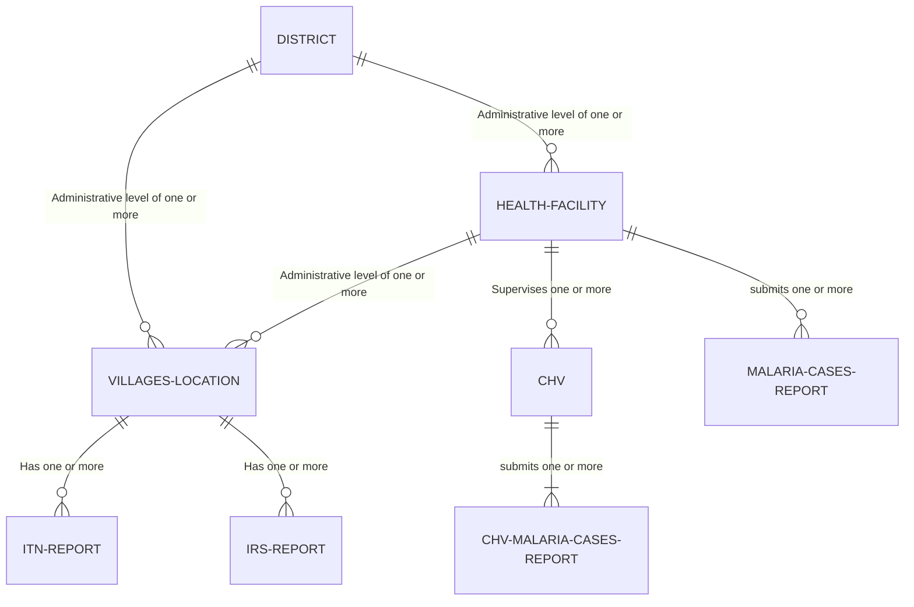

* **Fetch data from KoboToolBox into a Temporary Table pipeline:**
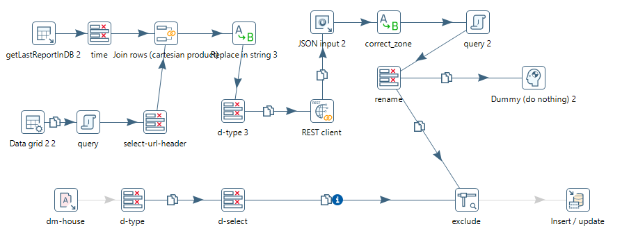{ align=center, width="700" }

* **Health Facilities merge and remove duplicates:**
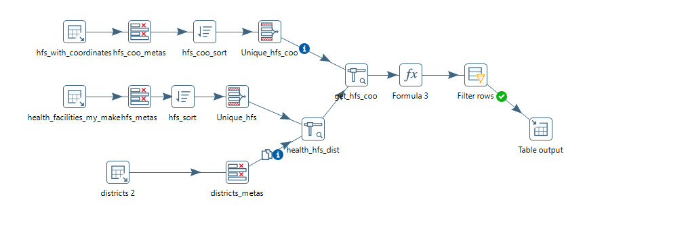{ align=center, width="700" }

* **Anti-Malaria Drugs merge workflow:**
Multiple steps merged into one picture

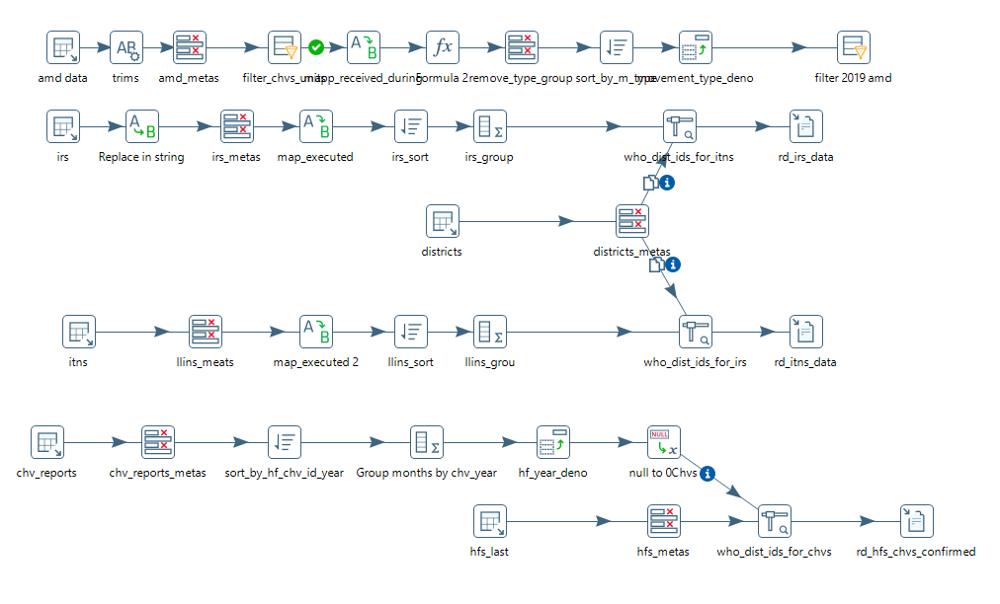{ align=center, width="700" }

Work flow 2:

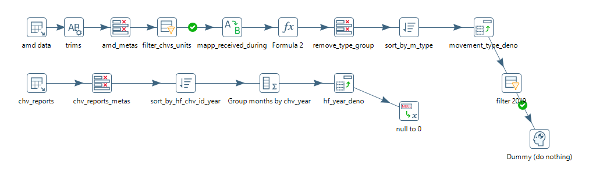{ align=center, width="700" }

* **Master list re-import into database workflow:**
After manual review

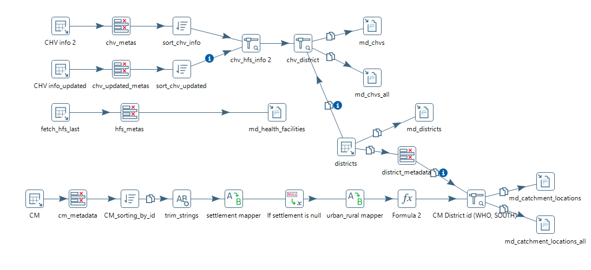{ align=center, width="700" }

* **Catchment Merge workflow:**

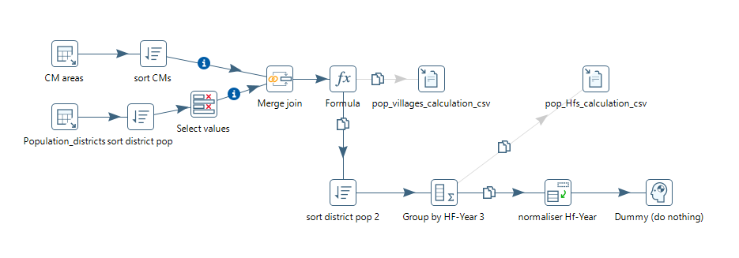{ align=center, width="700" }

* **verifications of Newly added catchments:**

      <div class="grid cards" markdown>

      * <figure markdown> 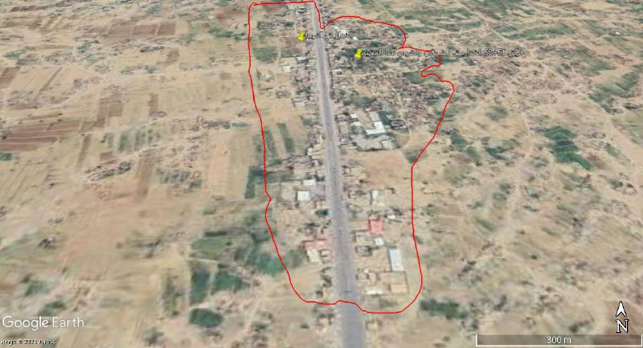{ width="450" }</figure>
      * <figure markdown> 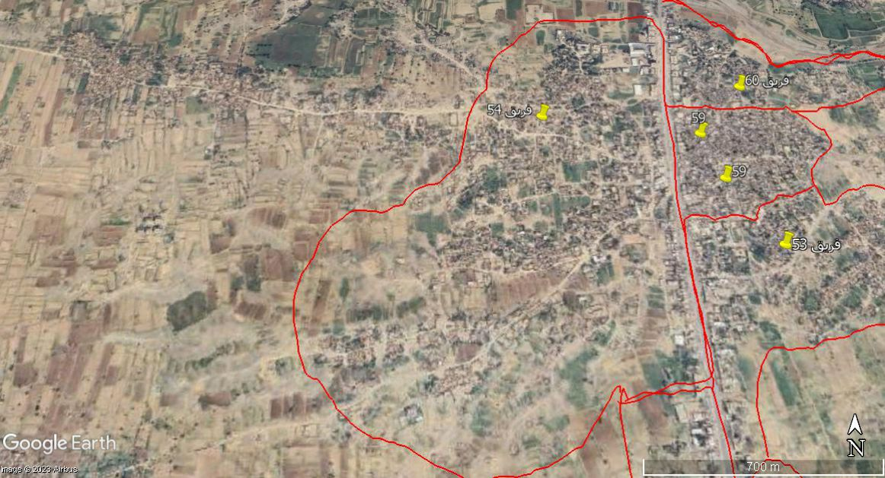{ width="450" }</figure>
      * <figure markdown> 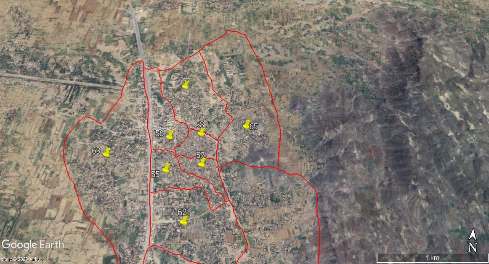{ width="450" }</figure>
      * <figure markdown> 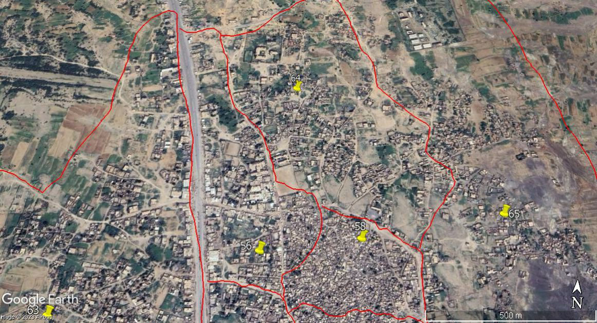{ width="450" }</figure>
      * <figure markdown> 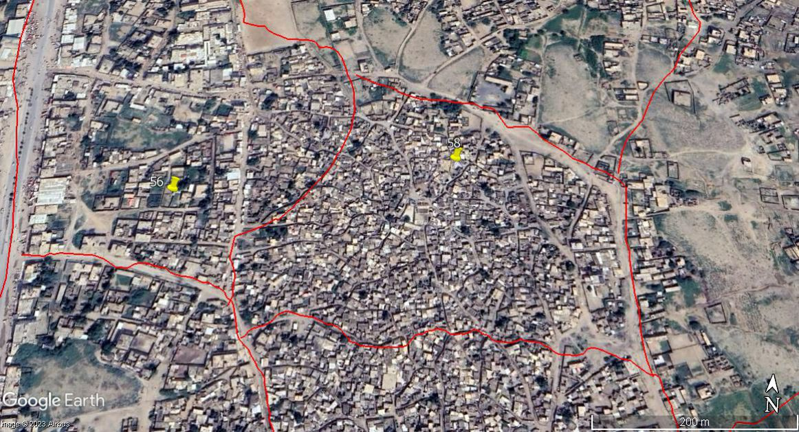{ width="450" }</figure>
      * <figure markdown> 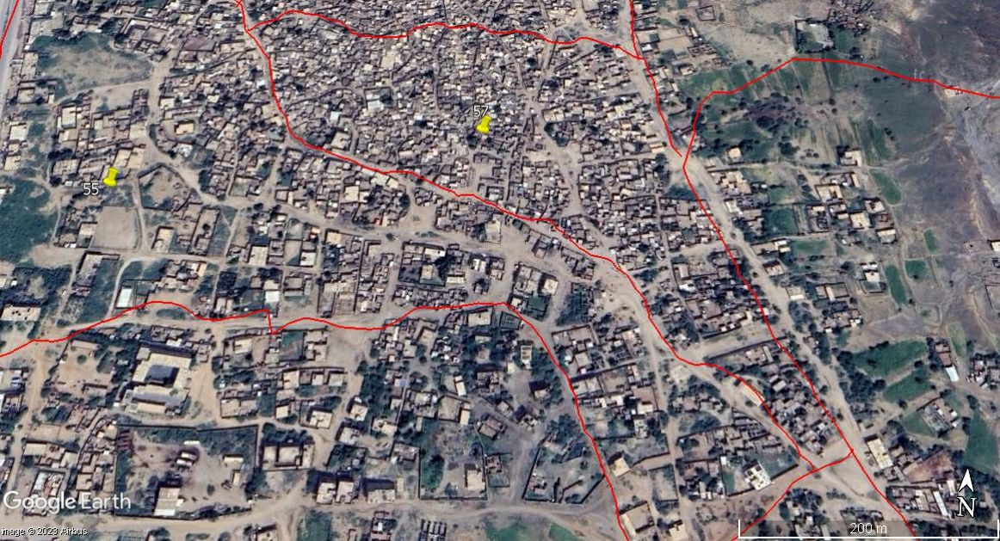{ width="450" }</figure>
      * <figure markdown> 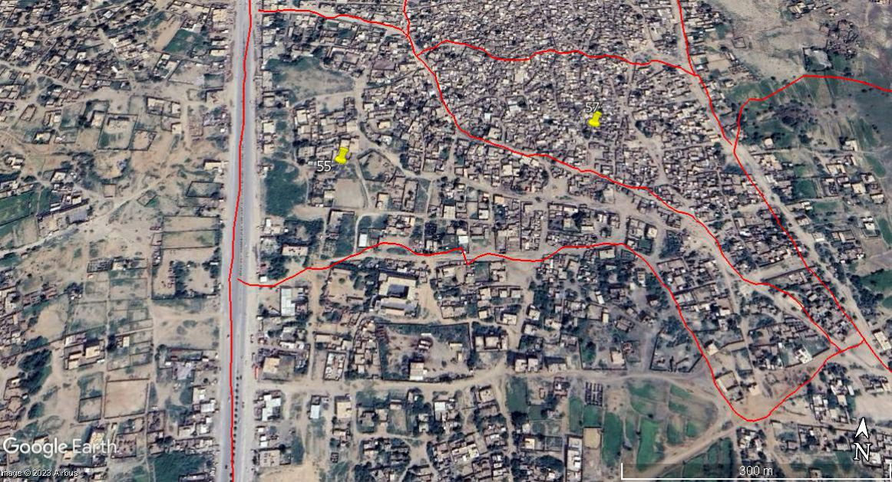{ width="450" }</figure>
      * <figure markdown> 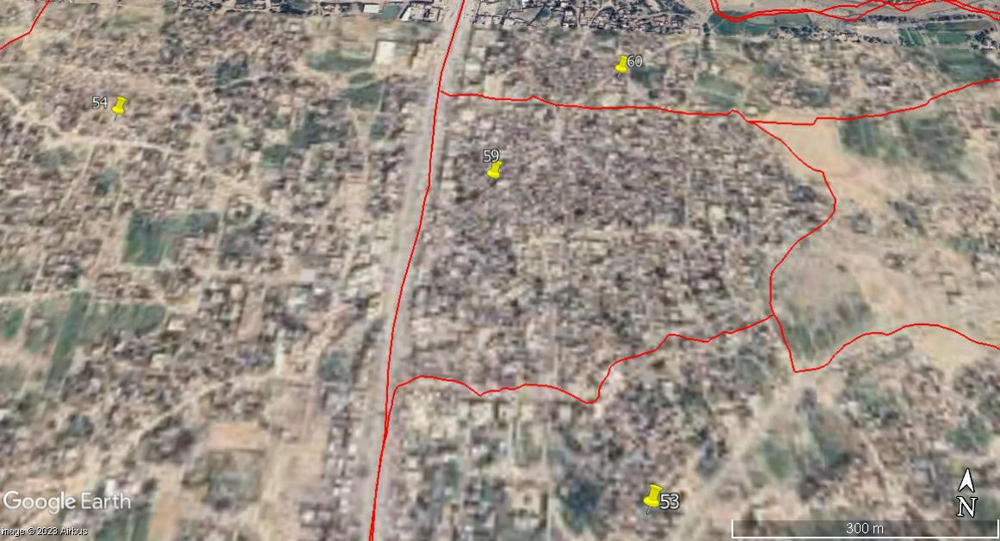{ width="450" }</figure>
      * <figure markdown> 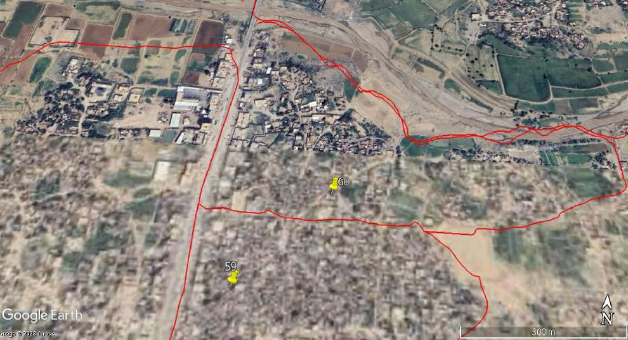{ width="450" }</figure>
      * <figure markdown> 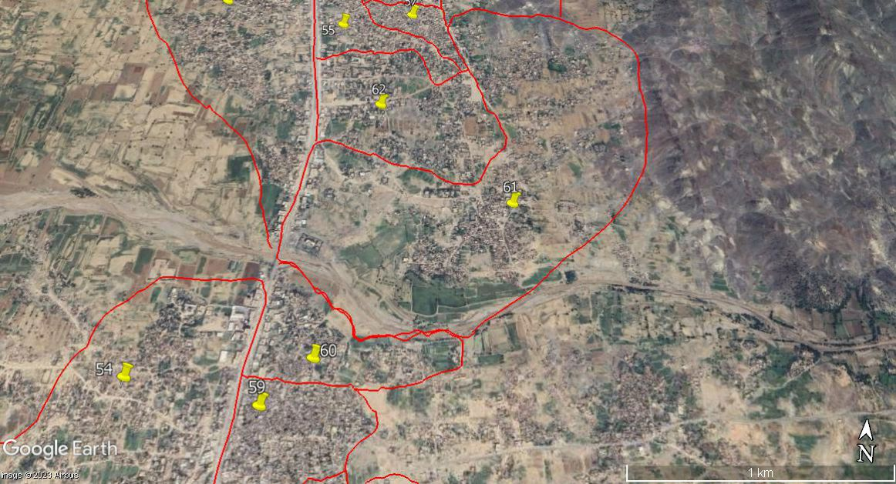{ width="450" }</figure>
      * <figure markdown> 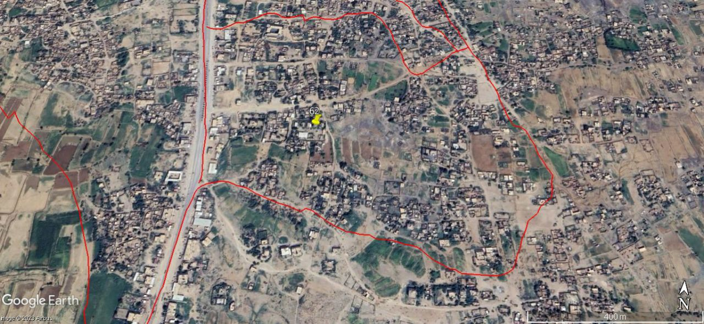{ width="450" }</figure>
      * <figure markdown> 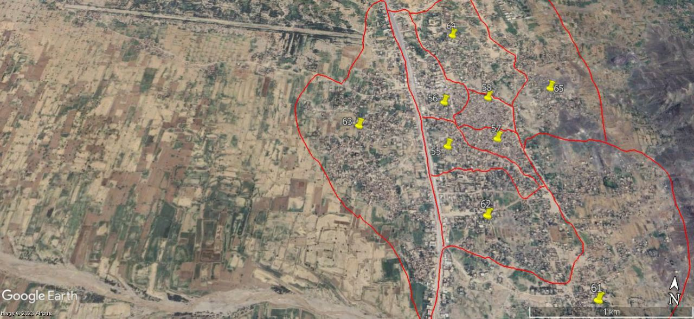{ width="450" }</figure>
      * <figure markdown> 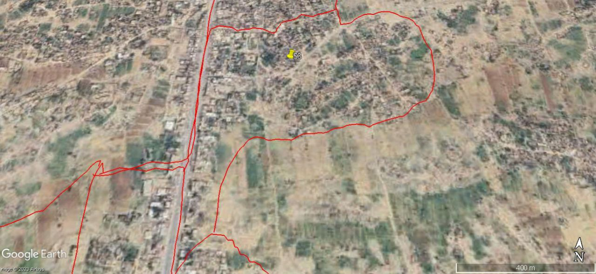{ width="450" }</figure>
      * <figure markdown> 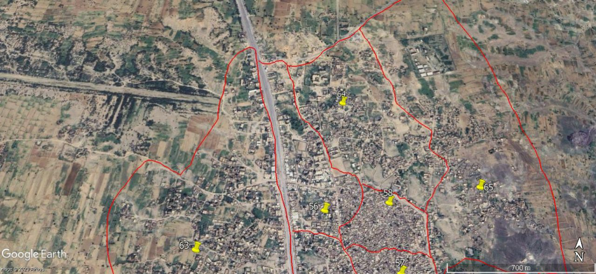{ width="450" }</figure>
      * <figure markdown> { width="450" }</figure>
      
      </div>

## Tables

Bellow are Summaries for data quality metrics, such as completeness rates and error rates, for each dataset and stage of the process.

**Final Status oF Data:**
as of **June, 24 2023**

The following table shows NORTH/SOUTH Health Facilities that have some data in the north files and needs either be mapped to catchments localities or locate their GPS coordinate:

{==:white_check_mark: Final Health Facilities Mapping & GPS status==}

| **hf_owner** | **-** | **WITH NO CATCHMENTS** | **WITH NO CATCHMENT & GPS** | **WITH NO GPS** |
| ------------ | :---: | ---------------------- | --------------------------- | --------------- |
| **OTHER**    |  292  |                        |                             |                 |
| **PRIVATE**  |  574  |                        |                             | 111             |
| **PUBLIC**   | 4692  | 848                    | 291                         | 1               |

There are currently {--118234--} {++120982++} locations in total, of which {--105855: 89%--} {++110898: 91%++} have been mapped to a **health facility** in the `md_health_facilities.csv` master file.

{==:white_check_mark: Final CMs Mapping status==}

| **S/N**     | **gov_id** | **gov**          |                 **%**                 | **MAPPED** | **UNMAPPED** |
| ----------- | :--------: | ---------------- | :-----------------------------------: | :--------: | :----------: |
| NORTH       |     11     | Ibb              |  |   16497    |              |
| NORTH       |     17     | Hajjah           |  |   14416    |              |
| NORTH       |     20     | Dhamar           |  |   14219    |              |
| NORTH/SOUTH |     18     | Al Hudaydah      |  |    9508    |              |
| NORTH       |     23     | Sana'a           |  |    7504    |      1       |
| NORTH       |     22     | Sa'ada           |  |    6992    |              |
| NORTH       |     31     | Raymah           |  |    6766    |              |
| NORTH       |     29     | Amran            |  |    6421    |              |
| NORTH       |     16     | Al Jawf          |  |    2650    |              |
| NORTH       |     27     | Al Mahwit        |  |    4788    |      29      |
| NORTH/SOUTH |     26     | Marib            |  |    2181    |     213      |
| NORTH       |     13     | Amanat Al Asimah |  |    5736    |     773      |
| NORTH/SOUTH |     15     | Taizz            |  |    9574    |     9068     |
| NORTH/SOUTH |     14     | Al Bayda         |  |    3646    |              |

**Join status between reports and catchments:**

* **ITNs Reports:** `rd_itns_data.csv` --> `md_catchment_locations.csv`

{==:white_check_mark: Final ITN's Records Mapping status ==}

| Total             | linked   | unlinked (IDPs Camps)     | unlinked Other   |
| ----------------- | :------: | :-----------------------: | :--------------: |
| 50735 **records** | 49806    | 155                       | 774              |

* **IRS Reports:** `rd_irs_data.csv` --> `md_catchment_locations.csv`

{== :white_check_mark: Final IRS Records Mapping status ==}

{++ After IRS 2022 data was Included ++}

| Total             | linked   | unlinked (IDPs Camps)  | unlinked Other |
| ----------------- | :------: | :--------------------: | :------------:|
| 41108 **records** | 39791    | 154                    | 1163           |

## Code Snippets

Bellow are Examples of key data cleaning and transformation techniques

* **Code of checking for duplicates in Health Facility lists**

1. **Libraries Import**:
    * `pandas`: For data manipulation and analysis.
    * `langdetect`: To detect the language of a given text.
    * `googletrans`: An unofficial library that uses Google Translate.
    * `polyglot`: Multilingual text processing library, used here for transliteration.
    * `fuzzywuzzy`: For fuzzy string matching.

2. **Language Processing Tools Initialization**:
    * The script downloads language resources for transliteration (`transliteration2.ar`) from `polyglot`.

3. **Constants and Mappings**:
    * `MIN_TEXT_LENGTH`: A minimum length for text to be considered for language detection and transliteration.
    * `THRESHOLD`: The threshold for fuzzy matching.
    * `mapped_words`: A dictionary mapping Arabic health facility names to their English abbreviations or translations.

4. **Function Definitions**:
    * `detect_language(text)`: Detects the language of the given text. If the text is too short or language detection fails, it returns `None`.
    * `transliterate_text(text, language, primary_language='en')`: Transliterates the text to English if it's not in the primary language and handles specific word mappings for healthcare-related terms.
    * `fuzzy_match(row, col1, col2, threshold)`: Performs fuzzy matching between two columns in a dataframe row and checks if the match ratio is above a certain threshold.
    * `trans_and_calculate_fuzzyness(file_path, cols_to_transliterate, match_col)`: Main function that applies transliteration and fuzzy matching to specified columns of a dataframe loaded from an Excel file. It creates new columns for transliterated text and the match percentages.
  
      ```python
      import pandas as pd

      from langdetect import detect
      from googletrans import Translator
      from polyglot.downloader import downloader
      from polyglot.transliteration import Transliterator
      from polyglot.detect import Detector
      from polyglot.text import Text
      from fuzzywuzzy import fuzz

      downloader.download("transliteration2.ar")

      MIN_TEXT_LENGTH = 2
      THRESHOLD = 50  # Set the threshold for fuzzy matching

      def detect_language(text):
      if len(str(text)) < MIN_TEXT_LENGTH:
            return None
      try:
            return detect(text)
      except LangDetectException:
            return None

      mapped_words = {
      'الوحدة الصحية': 'HU',
      'المركز الصحي': 'HC',
      'المجمع الصحي': 'Complex',
      'الصحية': 'HU',
      'وحدة': 'HU',
      'صحي': 'HC',
      'مستشفى': 'H',
      'مستوصف': 'Dispensary',
      'عيادة': 'Clinic',
      'طوارى': 'emergancy',
      'امومة': 'Maternity',
      'طفولة': 'Childhood',
      'الهلال': 'Crescent',
      'الصليب': 'Cross',
      'الأحمر': 'Red',
      'الطبي': 'Medical',
      'سجن مركزي': 'Central Jail',
      'سجن المركزي': 'Central Jail',
      'المركزي': 'Central',
      'مركز': 'HC',
      'النفسية': 'Psychological',
      'الجامعي': 'educational',
      'التعليمي': 'educational',
      'مختبر': 'Laboratory',
      'الوطني': 'National',
      'العامة': 'Public',
      'الخاص': 'Private',
      }

      def transliterate_text(text, language, primary_language='en'):
      if not isinstance(text, str) or len(text) < MIN_TEXT_LENGTH:
            return ""
      if language != primary_language:
            detector = Detector(text, quiet=True)
            if detector.language.code == 'ar':
            new_text = Text(text)
            transliterated_words = []
            list_text = new_text.transliterate("en")
            for index, value in enumerate(list_text):
                  original = new_text.words[index]

                  for no_transliterate_word_key, no_transliterate_word_value in mapped_words.items():
                        if no_transliterate_word_key in original:
                        break
                  else:
                        transliterated_words.append(value)

            transliterated_words.reverse()
            unique_list = []
            [unique_list.append(x) for x in transliterated_words if x not in unique_list]

            result = ' '.join(unique_list)
            return result
      return text

      def fuzzy_match(row, col1, col2, threshold):
      match_ratio = 0
      if isinstance(row[col2], str):
            match_ratio = fuzz.token_set_ratio(row[col1], row[col2].lower())

      if match_ratio >= threshold:
            return f"{match_ratio}%"
      else:
            return ""

      def trans_and_calculate_fuzzyness(file_path, cols_to_transliterate, match_col):
      df = pd.read_excel(file_path)
      for col in cols_to_transliterate:
            new_col_name = f"transliterated_{col}"
            df[new_col_name] = df[col].apply(lambda x: transliterate_text(x, detect_language(x)) if pd.notnull(x) else x)
      for col in cols_to_transliterate:
            transliterated_col = f"transliterated_{col}"
            match_result_col = f"match_percentage_{transliterated_col}"
            df[match_result_col] = df.apply(lambda x: fuzzy_match(x, match_col, transliterated_col, THRESHOLD), axis=1)
      df.to_excel("transliterated_output.xlsx", index=False)

      file_path = 'unified_translitrated.xlsx'
      trans_and_calculate_fuzzyness(file_path, ['hf_name_north_using_s_id_3','hf_name_north_using_7chars_4','hf_name_digit_5'], 'hf_name_ar_south_trans')
      ```

* **Normalize and standarize code, multiple purpose:**

```python
 # * **Health Facility Cleaning:**
 #   Normalizing health facility names is an essential step in data cleaning to ensure consistency and improve the accuracy of matching during the fuzzy matching process. Here's how I approached normalizing health facility columns:

# * **Mount Google Drive:**

# from google.colab import drive
# drive.mount('/content/drive')

## Enable Tables


# %load_ext google.colab.data_table

## Install necessary libraries

# Install necessary libraries

# !pip install fuzzywuzzy
# !pip install geopy

# !pip install transliterate

# !pip install pyspellchecker
# !pip install nltk
# !pip install polyglot
# !pip install langdetect

## Imports
import pandas as pd
from fuzzywuzzy import fuzz
from geopy.distance import geodesic

# from transliterate import translit

from spellchecker import SpellChecker
from nltk.stem import PorterStemmer
from nltk.corpus import stopwords
from polyglot.downloader import downloader
from polyglot.transliteration import Transliterator
from polyglot.detect import Detector
from polyglot.text import Text
from langdetect import detect

# Download NLTK resources

import nltk
nltk.download('stopwords')

## Load HFs from The Excel file

df1 = pd.read_excel('/content/drive/MyDrive/NMCP_CM _DB/health_facilities_all_edited.xlsx', sheet_name='amd')
df2 = pd.read_excel('/content/drive/MyDrive/NMCP_CM_DB/health_facilities_all_edited.xlsx', sheet_name='standard')
df3 = pd.read_excel('/content/drive/MyDrive/NMCP_CM _DB/health_facilities_all_edited.xlsx', sheet_name='eidwes')

df = pd.concat([df1, df2, df3], ignore_index=True)
df

## No transliterate Words

no_transliterate_hf_names = {
    'الوحدة الصحية': 'وحدة صحية',
    'المركز الصحي': 'مركز صحي',
    'المجمع الصحي': 'مجمع صحي',
    'مستشفى': 'مستشفى',
    'مستوصف': 'مستوصف',
    'عيادة': 'عيادة',
    'طوارى': 'طوارئ',
    'امومة': 'الأمومة',
    'طفولة': 'الطفولة',
    'الهلال': 'الهلال',
    'الصليب': 'الصليب',
    'الأحمر': 'أحمر',
    'الطبي': 'الطبي',
    'سجن مركزي': 'سجن مركزي',
    'سجن المركزي': 'سجن مركزي',
    'المركزي': 'المركزي',
    'مركز': 'مركز صحي',
    'الصحية': 'وحدة صحية',
    'وحدة': 'وحدة صحية',
    'صحي': 'مركز صحي',
    'النفسية': 'النفسية',
    'الجامعي': 'التعليمي',
    'التعليمي': 'التعليمي',
    'مختبر': 'مختبر',
    'الوطني': 'الوطني',
    'العامة': 'العام',
    'الخاص': 'الخاص',
}

## Transiltrate Arabic HFs sheets (AMD, And Herams)

def transliterate_arabic_to_english(arabic_name):
    try:
        # Transliterate Arabic name to English using ISO 233-2 standard
        english_name = translit(arabic_name, 'ar', reversed=True)
        return english_name
    except Exception as e:
        print(f"Error transliterating {arabic_name}: {e}")
        return arabic_name

df['facility_name_transliterated'] = df['facility_name'].apply(transliterate_arabic_to_english)

# # Spell checking

# spell = SpellChecker()

# df['facility_name_transliterated'] = df['facility_name_transliterated'].apply(lambda x: ' '.join([spell.correction(word) for word in x.split()]))

 df

## Normalize health facility names

### Common Normalizing steps

# * Handle empty values.

# * Handle numeric values or containing numbers.
# * Convert all health facility names to lowercase for consistency.
# * Remove punctuation and special characters to ensure clean text.
# * Strip leading and trailing whitespaces to prevent inconsistencies.
# * Replace multiple spaces with a single space for uniformity.

df['facility_name_norm'] = df['facility_name']
df['facility_name_norm'] = df['facility_name_norm'].fillna('')
df['facility_name_norm'] = df['facility_name_norm'].astype(str)

df['facility_name_norm'] = df['facility_name_norm'].str.lower()
df['facility_name_norm'] = df['facility_name_norm'].str.replace('[^\w\s]', '')
df['facility_name_norm'] = df['facility_name_norm'].str.strip()
df['facility_name_norm'] = df['facility_name_norm'].str.replace('\s+', ' ')

### Other Normalizing steps

# * Expand common abbreviations to their full form for better matching.
# * removing common stop words that do not contribute significantly to the identification of a facility.
# * Create a mapping for synonyms or variations in facility names to standardize them.
# * Applies stemming to reduce words to their base or root form and removes common English stop words.
# * Optionally, perform spell checking to correct common typos or misspellings.

# Replace

df['facility_name'] = df['facility_name'].replace({' H ': ' Hospital '}, regex=True)

stop_words = set(stopwords.words('english'))
df['facility_name'] = df['facility_name'].apply(lambda x: ' '.join([word for word in x.split() if word.lower() not in stop_words]))

# Replace synonyms with a common names

synonym_mapping = {'HU': 'Health Unit'}
df['facility_name'] = df['facility_name'].replace(synonym_mapping, regex=True)

# NLTK for stemming

stemmer = PorterStemmer()
df['facility_name'] = df['facility_name'].apply(lambda x: ' '.join([stemmer.stem(word) for word in x.split()]))

# Spellchecker

spell = SpellChecker()
df['facility_name'] = df['facility_name'].apply(lambda x: ' '.join([spell.correction(word) for word in x.split()]))

## Normalize GPS coordinates

# This step ensures that coordinates are represented consistently and reduces noise.

# * Round latitude and longitude to 6 decimal places for consistency.
# * Check for missing or invalid coordinates and removing records with missing coordinates.
# * Outlier Detection

# Format latitude and longitude to a consistent number of decimal places

df['latitude'] = df['latitude'].round(6)
df['longitude'] = df['longitude'].round(6)

# Drop rows with missing coordinates

df = df.dropna(subset=['latitude', 'longitude'])

# Remove outliers based on a predefined threshold

latitude_threshold = (df['latitude'].quantile(0.01), df['latitude'].quantile(0.99))
longitude_threshold = (df['longitude'].quantile(0.01), df['longitude'].quantile(0.99))

df = df[(df['latitude'] >= latitude_threshold[0]) & (df['latitude'] <= latitude_threshold[1])]
df = df[(df['longitude'] >= longitude_threshold[0]) & (df['longitude'] <= longitude_threshold[1])]
```
