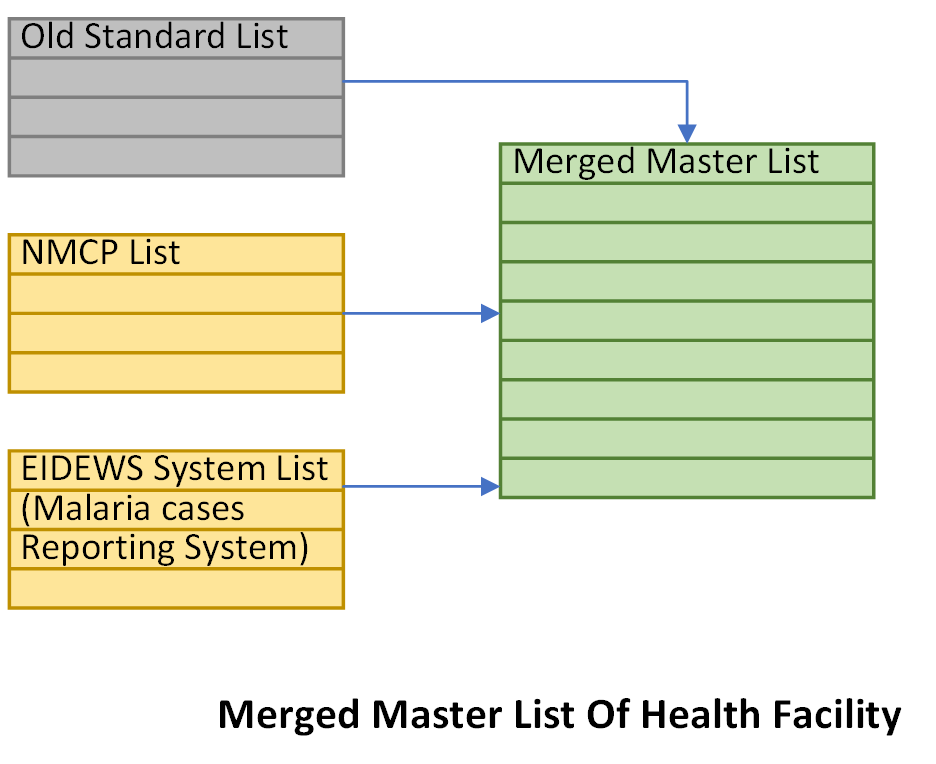
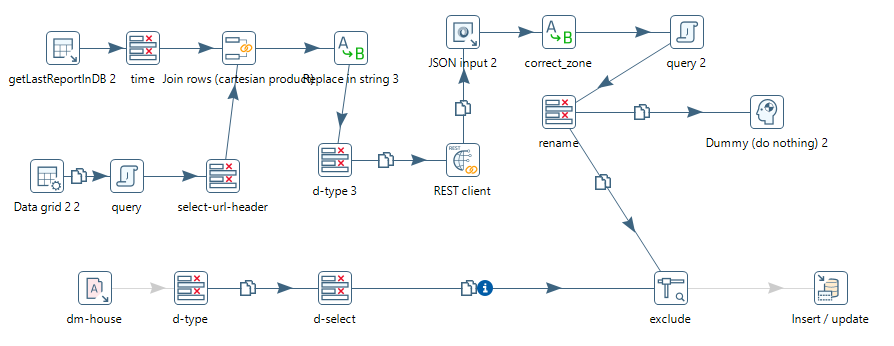
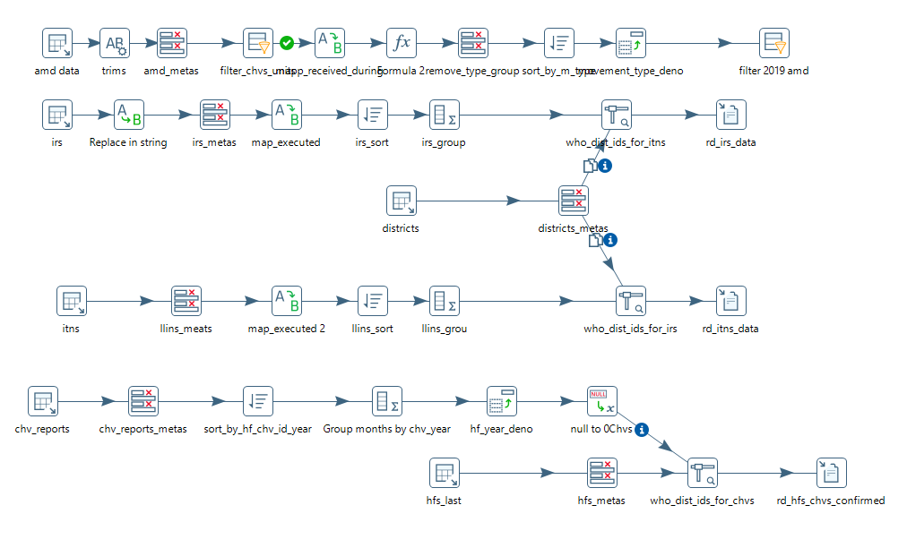
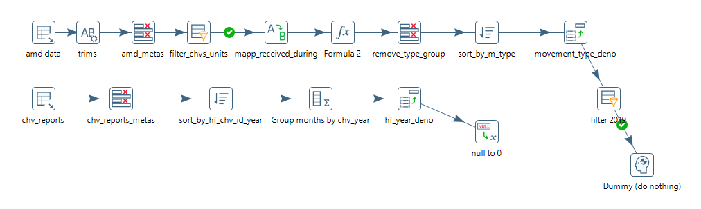
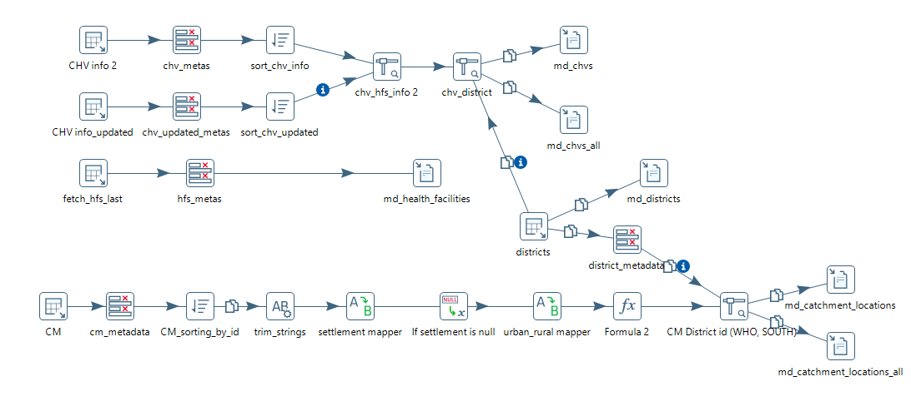
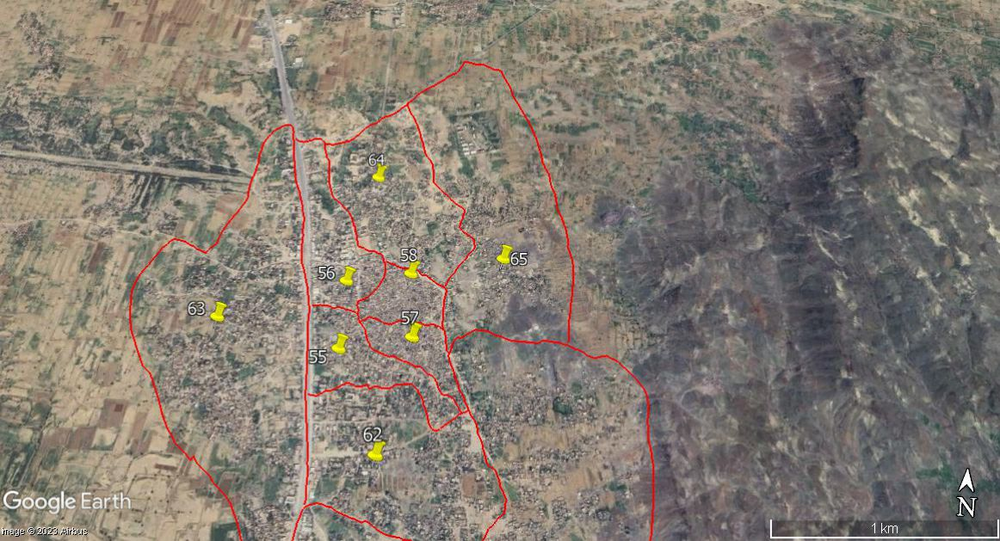
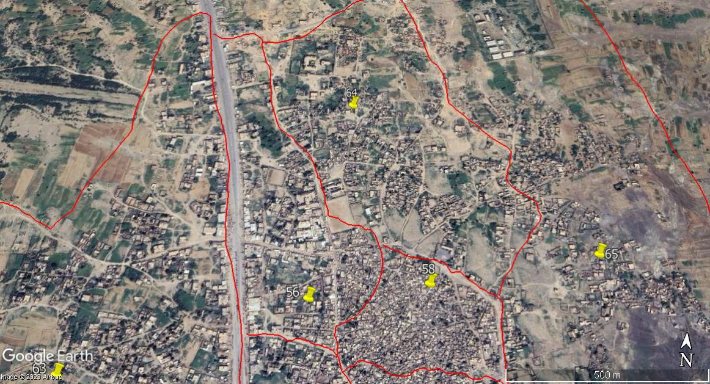
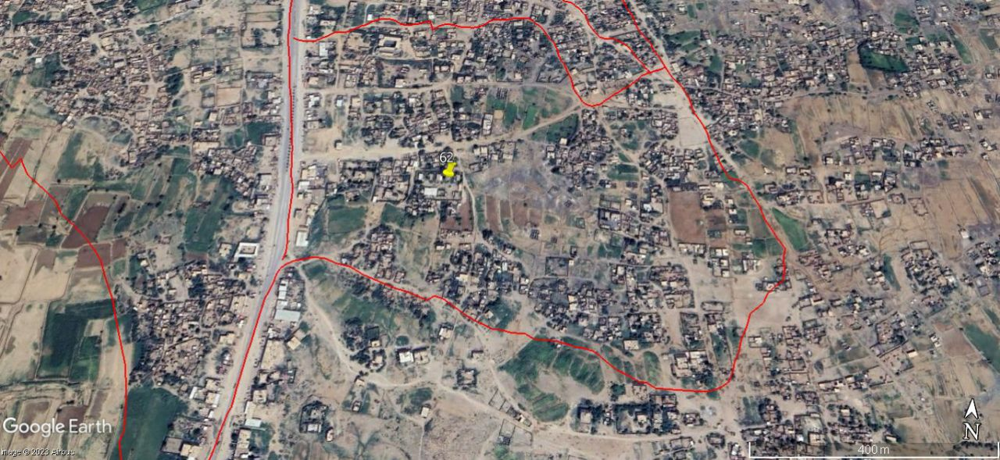
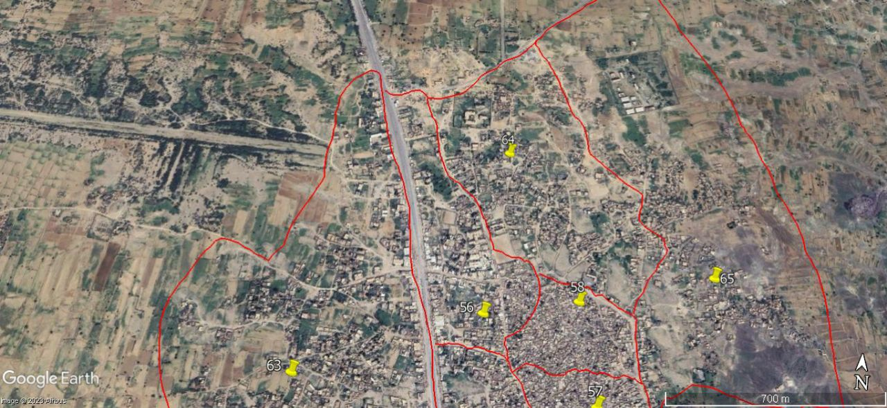
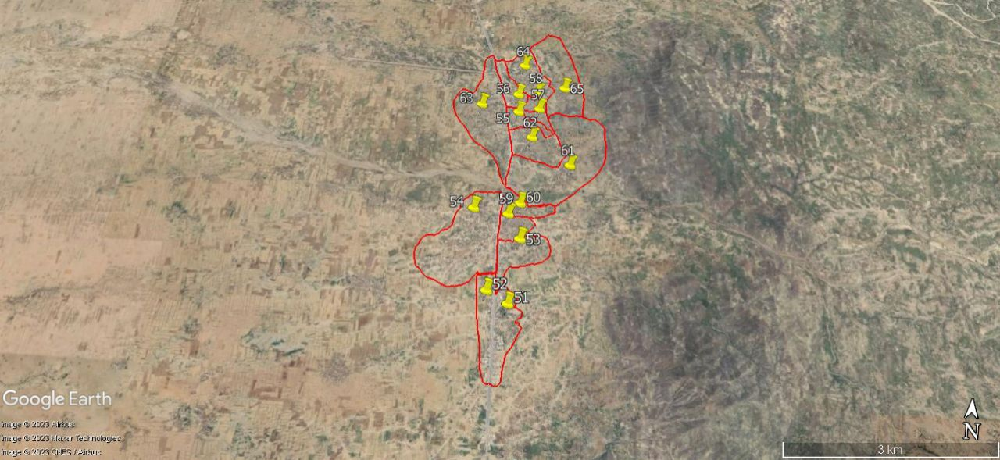

[TOC]

# Report final

**Project:** Data assembly and cleaning Of NMCP Yemen and automating the workflow for the risk map of Malaria in Yemen for planning future campaigns resources and funding:

## Executive Summary

**Challenge:** The National Malaria Control Program (NMCP) in Yemen faces significant challenges in analyzing and utilizing its vast data on malaria control activities due to inconsistencies in data formats, codes, and collection methods. This lack of data accessibility and quality hinders effective program evaluation, intervention targeting, and resource allocation.

**Approach:** The project used a Collaborative Approach Engaging a cross-functional team to collaboratively address inconsistencies in data formats, Actively involving *Risk analysis team* in harmonization decisions, ensuring alignment with program goals, and Iteratively refining entity relationships based on feedback from them and NMCP management. The collaborative approach has resulted in a coherent dataset that reflects the collective expertise of the team.

**Result:** This project successfully mapped all NMCP activity data into a structured format, significantly improving data accessibility and quality. Data completeness and accuracy metrics saw substantial improvements, and the established data model allows for comprehensive analysis across different entities and activities. Data visualization dashboards now provide real-time insights into key malaria control indicators, enabling informed decision-making for program optimization and resource allocation. Any Future data can be easily checked, validated, cleaned, and merged using the automated solution and the pipeline developed in this project.

**Impact:** This project empowers the NMCP with a robust data foundation for effective malaria control efforts. Improved data accessibility and quality will lead to:

* **Enhanced program monitoring and evaluation:** Real-time data insights will enable the NMCP to track progress towards malaria elimination goals and identify areas requiring improvement.
* **Targeted interventions:** Data-driven analysis will inform the development of more effective and targeted interventions, maximizing resource utilization and impact.
* **Improved resource allocation:** Data analysis will guide the allocation of resources to areas with the highest burden of malaria, ensuring efficient and equitable program implementation.
* **Knowledge sharing and collaboration:** The structured data model facilitates data sharing and collaboration with other stakeholders, promoting knowledge exchange and coordinated efforts in malaria control.

**Recommendations:** Building upon this success, the NMCP should:

* **Continue data quality improvement:** Implement ongoing data quality monitoring and maintenance procedures to ensure data integrity and reliability.
* **Integrate with other data sources:** Combine malaria control data with other relevant data sources (e.g., weather, population) for comprehensive analysis and prediction.
* **Promote data utilization:** Train NMCP personnel and stakeholders on data analysis tools and techniques to maximize the utilization of data for informed decision-making.

By leveraging the foundation established by this project, the NMCP can accelerate its progress towards a malaria-free future in Yemen.

## Introduction

Malaria remains a significant public health threat in Yemen, with 150K cases reported annually. Effective control requires a comprehensive understanding of the disease dynamics, intervention effectiveness, and resource allocation strategies. However, the National Malaria Control Program (NMCP) faces significant challenges in utilizing its vast data on malaria control activities due to:

* **Data inconsistencies:** Data from various sources often use different formats, codes, and collection methods, making it difficult to integrate and analyze effectively.
* **Data quality issues:** Incompleteness, inaccuracies, and missing data further hinder the reliability and usability of the information.
* **Limited data accessibility:** Data is often stored in disparate silos, making it difficult for program managers and stakeholders to access and utilize it for informed decision-making.

Recognizing these challenges, the NMCP embarked on a critical initiative to map all its activity data into a unified, structured format. This project aimed to:

* **Create master lists:** Review and Update the standardized lists available of key entities involved in malaria control, such as villages, health facilities, and community health volunteers. and develop the missing ones needed for the mapping process.
* **Connect/Define Catchment of each health facilities:** connect health facilities with their corresponding catchment villages. Building on an Existing mapping and utilizing a data-driven approach and robust methodologies, to establish a detailed catchment map that empowers informed resource allocation and optimizes service delivery within the region.
* **Automated Data Pipelines (Pentaho and Python-Powered):** Implement lately to streamlined data processing and maintained data integrity throughout the analysis by employing Pentaho to orchestrate data extraction, and transformation processes. create scripts to address some data inconsistencies, including standardization, and normalization.
* **Clean and merge data:** Review, clean, and merge data routine/not routine data from various sources, ensuring consistency and compatibility with the master lists.
* **Develop data visualization tools:** Create interactive dashboards and reports to visualize trends, analyze intervention effectiveness, and track progress towards malaria control goals.
* **Implement testing:** to guarantee data integrity and consistency before merging into the production Database.

This report details the methodology, results, and impact of this data mapping project. It highlights the significant improvements in data accessibility, quality, and utilization, paving the way for enhanced malaria control efforts in Yemen.

## 2. Methodology

### 2.1 Data Sources

The project integrated data from the following primary sources:

* **ITN Distribution Data:**
      - **Format:** Excel spreadsheets with village codes, household counts, net quantities, team, date, etc.
      - **Inconsistencies:**
        - Village code formats: Mixing numeric and alphanumeric formats, missing or incomplete codes.
        - Data entry errors.
        - Missing values, inconsistencies with reported village population.
        - Mismatches in date of submission_time.
* **IRS Data:**
      - **Format:** Excel spreadsheets with sprayed structures, dates, insecticides, ...
      - **Inconsistencies:**
        - Village code formats: Mixing numeric and alphanumeric formats, missing or incomplete codes.
        - Personnel names: Variations in spelling, abbreviations, missing names.
        - Mismatches in date of submission_time
* **LSM Data:**
      - **Format:** Paper-based and Electronic forms with breeding site identification, treatment methods, dates.
      - **Inconsistencies:**
        - Transcription errors due to manual data entry.
        - Incompatible data types for similar variables (e.g., income as categorical vs. continuous)
        - Incomplete data: Missing information on breeding site type, treatment dosage, etc.
* **CHV Data:**
      - **Format:** Excel spreadsheets with CHV demographics, village assignments, malaria case reports.
      - **Inconsistencies:**
        - Duplicate CHV records due to name variations or reassignments.
        - Village: Not coded and uses names having variations in spelling, missing or incomplete names.
        - Missing info about time of assignment or withdrawal.
* **Malaria Cases Data:**
      - **Format:** NMCP database with Monthly case reports, EIdews database with Weekly case reports.
      - **Inconsistencies:**
        - Inconsistencies in coding systems, data entry errors, and missing values were common.
        - Facility codes: Inaccurate or outdated facility codes impacting data aggregation.
        - Different temporal collection: 2011-2016 Monthly, and 2017 onward is weekly.
        - adding/removing dataelements and updating structure from year to another.
        - changed sources of data: NMCP and then EIdews, resulting in discrepancies in health facility coding, often with varying levels of granularity
* **Administrative Data:**
      - **Format:** Country GIS Geodata database, Standard Health Facilities information, Excel spreadsheets Community Health Volunteers list.
      - **Inconsistencies:**
        - Outdated Country GIS Geodata database.
        - Facility codes: Inaccurate or outdated facility codes impacting data aggregation.
        - Duplicate of records in the GIS Geodata database.
        - Other different inconsistencies.
        - Duplicate Health Facilities records and inconsistencies in names required automated and manual careful resolution.

### 2.2 Processing Workflow

**2.2.1 Data Cleaning and Transformation:**

* **Standardization:**
      - Village codes: Harmonized across datasets using a master list, ensuring one-to-one mapping and eliminating ambiguities.
      - Date formats: Converted to a consistent format (e.g., ISO 8601) for improved sorting and analysis.
      - Personnel names: Standardized using string normalization techniques and cross-referencing with personnel records.
      - Implement soundex and other phonetic matching techniques to identify potential duplicates and variations, followed by manual verification and standardization.
      - Temporal Alignment: Align Malaria Cases data with varying temporal granularities using interpolation and/or aggregation techniques.
* **Error Correction:**
      - Applied techniques such as rule-based error correction, outlier detection, and imputation to address inconsistencies and missing values..
      - Fuzzy matching to link village/HF names with similar spellings in the master list.
      - Leverage Python library dateutil to parse various formats and convert to a consistent ISO 8601 standard.
      - Utilize imputation techniques like mean/median imputation or K-Nearest Neighbors to fill in missing values based on context and relationships within the data.
      - Manual review and correction of identified errors, ensuring data integrity through:
          - left it unchanged: The most conservative course of action was to accept the data as a valid response and made no change to it. The larger the sample size, the less one suspect response would affect the analysis; the smaller the sample size, the more difficult the decision was.
          - Corrected the data: If the respondent’s original intent could be determined, we corrected the answer.
          - Soft-deleted the data: If The data seemed illogical and the value was so far from the norm that it would affect descriptive or inferential statistics. We resorted to Soft-Deleting just this response or the entire record. To understand the impact of deleting a data point, a binary variable was created (1=suspicious record, 0=not suspicious). This new variable was used as a record filter in Pivot tables or in-table filtering to understand the impact of potentially erroneous data in the final results.
          - If it was possible, we re-measured the suspected or erroneous values. through returning back to the paper registers, contacting the collector...etc.
          - we kept logs for what changed while maintaining the original data for future checks.

* **Outlier Handling:**
      - Investigation of potential outliers (e.g., unusually high net distributions) through data visualization and cross-referencing with other sources.

**2.2.2 Master List Creation and Maintenance:**

* **Village list:** Consolidated and standardized village names and codes from multiple sources, addressing duplicates and inconsistencies.
* **Health facility list (HF):**
      - A comprehensive list of health facilities was created with unique codes, names, and geographic coordinates, merging HFs from EIdews Malaria cases reporting system and NMCP records to provide a clear picture of health infrastructure, merged different sources into one.
      - Checked and updated the list through collaboration with local authorities and community to reflect changes in facility closures, expansions, or changes in operational status.
      - **Collaborative Master List Management:** The master list maintenance involves a collaborative approach:
          - * **Community engagement:** Working with local village representatives and health facilities to verify village boundaries and facility locations.
          - **Online platform:** Developing a web-based portal for everyone to report discrepancies and suggest updates to the master list.
          - **Version control system:** Implementing a version control system to track changes and revert to previous versions if necessary.

{ align=center, width="400" }

{ align=center, width="450" }

* **CHV list:**
      - Compiled a comprehensive list of CHVs with unique identifiers, demographic information, village assignments, and contact details, resolving duplicate records.
      - Implement de-duplication algorithms to identify and merge duplicate CHV records based on unique identifiers, demographics, and village assignments.
      - Cross-reference CHVs with village master list to ensure accurate village assignments and avoid inconsistencies.

#### 2.2.3 Data Merging and Integration

* **Mapping to master lists:** Linked activity data to corresponding master lists using village codes, health facility codes, and CHV identifiers.
* **Resolving Record Linkage Issues:** Employed probabilistic matching techniques to account for variations in names and addresses, with manual verification for high-confidence matches.
* **Resolving inconsistencies:** Addressed discrepancies in codes or names through manual verification and cross-referencing with original data sources.
* **Data validation checks:** Implemented automated checks to ensure consistency between data sources, such as comparing ITN quantities with household counts and verifying CHV village assignments, proactively identifying and addressing potential errors.
* **Automate Future Data Merging:** Implemented automated submission of data from Kobo forms, so data can be directly sent to at will to their respective tables in this structure for analysis.

#### 2.2.4 Data Quality Assessment

* **Data lineage tracking:** Tracing the origin and transformations of each data point to ensure transparency and audibility.
* **Validation checks:** Implemented domain-specific validation rules (e.g., checking if reported net quantities fall within plausible ranges for village sizes). Verified data integrity through cross-referencing with external sources (e.g., population data).
* **Completeness Analysis:** Calculated the percentage of missing values for key variables and analyzed the distribution of missingness across different datasets. Identified patterns and potential reasons for missing data (e.g., reporting delays, data entry challenges). Documented for improved future training programs to improve data collection and reporting practices.

#### 2.2.5 Complementing Implementations

* **Additional Metadata Tables:** Additional metadata tables to capture supplementary information were created. For example, tables for recording specific campaign parameters, team details, or warehouse attributes.
* **Logs and Audit Trails:** Lately We implemented logging and audit trail mechanisms to track changes to critical data. This would ensures accountability and helps in troubleshooting if issues arise.
* **Reporting and integration Tables:** When campaigns involved integration with external systems or data sources such as Kobo or ODK,  additional tables, and views where added to handle any integration seamlessly. To generate reports and analytics, additional tables and views were created too and optimized for reporting purposes. Which could help improve the performance of complex queries.

### 2.3 Tools and Technologies

* **Data cleaning and integration:** Python (pandas, NumPy, and other libraries), Pentaho Data Integration and MetaData Management, OpenRefine, facilitated automated data manipulation and cleaning tasks. SQL, Excel.
* **Data storage:** PostgreSQL database with version control and audit trails.
* **Data visualization:** Power BI enabled the creation of interactive dashboards and reports for data visualization and analysis.

### Additional Data

#### Diagrams

Bellow are Visuals that depict the data processing workflow, master list structures, Pentaho integration Work flow and relationships between datasets.

* **Final Structure of main Tables:**


* **Fetch data from KoboToolBox into a Temporary Table pipeline:**
{ align=center, width="700" }

* **Health Facilities merge and remove duplicates:**
{ align=center, width="700" }

* **Anti-Malaria Drugs merge workflow:**
Multiple steps merged into one picture

{ align=center, width="700" }

Work flow 2:

{ align=center, width="700" }

* **Master list re-import into database workflow:**
After manual review

{ align=center, width="700" }

* **Catchment Merge workflow:**

{ align=center, width="700" }

* **Picture showing some manual verifications of catchments:**

      <div class="grid cards" markdown>

      * <figure markdown> { width="450" }</figure>
      * <figure markdown> { width="450" }</figure>
      * <figure markdown> { width="450" }</figure>
      * <figure markdown> { width="450" }</figure>
      * <figure markdown> { width="450" }</figure>
      * <figure markdown> { width="450" }</figure>
      * <figure markdown> { width="450" }</figure>
      * <figure markdown> { width="450" }</figure>
      * <figure markdown> { width="450" }</figure>
      * <figure markdown> { width="450" }</figure>
      * <figure markdown> { width="450" }</figure>
      * <figure markdown> { width="450" }</figure>
      * <figure markdown> { width="450" }</figure>
      * <figure markdown> { width="450" }</figure>
      * <figure markdown> { width="450" }</figure>
      
      </div>

#### Tables

Bellow are Summaries for data quality metrics, such as completeness rates and error rates, for each dataset and stage of the process.

**Final Status oF Data:**
as of **June, 24 2023**

The following table shows NORTH/SOUTH Health Facilities that have some data in the north files and needs either be mapped to catchments localities or locate their GPS coordinate:

{==:white_check_mark: Final Health Facilities Mapping & GPS status==}

| **hf_owner** | **-** | **WITH NO CATCHMENTS** | **WITH NO CATCHMENT & GPS** | **WITH NO GPS** |
| ------------ | :---: | ---------------------- | --------------------------- | --------------- |
| **OTHER**    |  292  |                        |                             |                 |
| **PRIVATE**  |  574  |                        |                             | 111             |
| **PUBLIC**   | 4692  | 848                    | 291                         | 1               |

There are currently {--118234--} {++120982++} locations in total, of which {--105855: 89%--} {++110898: 91%++} have been mapped to a **health facility** in the `md_health_facilities.csv` master file.

{==:white_check_mark: Final CMs Mapping status==}

| **S/N**     | **gov_id** | **gov**          |                 **%**                 | **MAPPED** | **UNMAPPED** |
| ----------- | :--------: | ---------------- | :-----------------------------------: | :--------: | :----------: |
| NORTH       |     11     | Ibb              |  |   16497    |              |
| NORTH       |     17     | Hajjah           |  |   14416    |              |
| NORTH       |     20     | Dhamar           |  |   14219    |              |
| NORTH/SOUTH |     18     | Al Hudaydah      |  |    9508    |              |
| NORTH       |     23     | Sana'a           |  |    7504    |      1       |
| NORTH       |     22     | Sa'ada           |  |    6992    |              |
| NORTH       |     31     | Raymah           |  |    6766    |              |
| NORTH       |     29     | Amran            |  |    6421    |              |
| NORTH       |     16     | Al Jawf          |  |    2650    |              |
| NORTH       |     27     | Al Mahwit        |  |    4788    |      29      |
| NORTH/SOUTH |     26     | Marib            |  |    2181    |     213      |
| NORTH       |     13     | Amanat Al Asimah |  |    5736    |     773      |
| NORTH/SOUTH |     15     | Taizz            |  |    9574    |     9068     |
| NORTH/SOUTH |     14     | Al Bayda         |  |    3646    |              |

**Join status between reports and catchments:**

* **ITNs Reports:** `rd_itns_data.csv` --> `md_catchment_locations.csv`

{==:white_check_mark: Final ITN's Records Mapping status ==}

| Total             | linked   | unlinked (IDPs Camps)     | unlinked Other   |
| ----------------- | :------: | :-----------------------: | :--------------: |
| 50735 **records** | 49806    | 155                       | 774              |

* **IRS Reports:** `rd_irs_data.csv` --> `md_catchment_locations.csv`

{== :white_check_mark: Final IRS Records Mapping status ==}

{++ After IRS 2022 data was Included ++}

| Total             | linked   | unlinked (IDPs Camps)  | unlinked Other |
| ----------------- | :------: | :--------------------: | :------------:|
| 41108 **records** | 39791    | 154                    | 1163           |

#### Code Snippets

Bellow are Examples of key data cleaning and transformation techniques

* **Code of checking for duplicates in Health Facility lists**

1. **Libraries Import**:
    * `pandas`: For data manipulation and analysis.
    * `langdetect`: To detect the language of a given text.
    * `googletrans`: An unofficial library that uses Google Translate.
    * `polyglot`: Multilingual text processing library, used here for transliteration.
    * `fuzzywuzzy`: For fuzzy string matching.

2. **Language Processing Tools Initialization**:
    * The script downloads language resources for transliteration (`transliteration2.ar`) from `polyglot`.

3. **Constants and Mappings**:
    * `MIN_TEXT_LENGTH`: A minimum length for text to be considered for language detection and transliteration.
    * `THRESHOLD`: The threshold for fuzzy matching.
    * `mapped_words`: A dictionary mapping Arabic health facility names to their English abbreviations or translations.

4. **Function Definitions**:
    * `detect_language(text)`: Detects the language of the given text. If the text is too short or language detection fails, it returns `None`.
    * `transliterate_text(text, language, primary_language='en')`: Transliterates the text to English if it's not in the primary language and handles specific word mappings for healthcare-related terms.
    * `fuzzy_match(row, col1, col2, threshold)`: Performs fuzzy matching between two columns in a dataframe row and checks if the match ratio is above a certain threshold.
    * `trans_and_calculate_fuzzyness(file_path, cols_to_transliterate, match_col)`: Main function that applies transliteration and fuzzy matching to specified columns of a dataframe loaded from an Excel file. It creates new columns for transliterated text and the match percentages.
  
      ```python
      import pandas as pd

      from langdetect import detect
      from googletrans import Translator
      from polyglot.downloader import downloader
      from polyglot.transliteration import Transliterator
      from polyglot.detect import Detector
      from polyglot.text import Text
      from fuzzywuzzy import fuzz

      downloader.download("transliteration2.ar")

      MIN_TEXT_LENGTH = 2
      THRESHOLD = 50  # Set the threshold for fuzzy matching

      def detect_language(text):
      if len(str(text)) < MIN_TEXT_LENGTH:
            return None
      try:
            return detect(text)
      except LangDetectException:
            return None

      mapped_words = {
      'الوحدة الصحية': 'HU',
      'المركز الصحي': 'HC',
      'المجمع الصحي': 'Complex',
      'الصحية': 'HU',
      'وحدة': 'HU',
      'صحي': 'HC',
      'مستشفى': 'H',
      'مستوصف': 'Dispensary',
      'عيادة': 'Clinic',
      'طوارى': 'emergancy',
      'امومة': 'Maternity',
      'طفولة': 'Childhood',
      'الهلال': 'Crescent',
      'الصليب': 'Cross',
      'الأحمر': 'Red',
      'الطبي': 'Medical',
      'سجن مركزي': 'Central Jail',
      'سجن المركزي': 'Central Jail',
      'المركزي': 'Central',
      'مركز': 'HC',
      'النفسية': 'Psychological',
      'الجامعي': 'educational',
      'التعليمي': 'educational',
      'مختبر': 'Laboratory',
      'الوطني': 'National',
      'العامة': 'Public',
      'الخاص': 'Private',
      }

      def transliterate_text(text, language, primary_language='en'):
      if not isinstance(text, str) or len(text) < MIN_TEXT_LENGTH:
            return ""
      if language != primary_language:
            detector = Detector(text, quiet=True)
            if detector.language.code == 'ar':
            new_text = Text(text)
            transliterated_words = []
            list_text = new_text.transliterate("en")
            for index, value in enumerate(list_text):
                  original = new_text.words[index]

                  for no_transliterate_word_key, no_transliterate_word_value in mapped_words.items():
                        if no_transliterate_word_key in original:
                        break
                  else:
                        transliterated_words.append(value)

            transliterated_words.reverse()
            unique_list = []
            [unique_list.append(x) for x in transliterated_words if x not in unique_list]

            result = ' '.join(unique_list)
            return result
      return text

      def fuzzy_match(row, col1, col2, threshold):
      match_ratio = 0
      if isinstance(row[col2], str):
            match_ratio = fuzz.token_set_ratio(row[col1], row[col2].lower())

      if match_ratio >= threshold:
            return f"{match_ratio}%"
      else:
            return ""

      def trans_and_calculate_fuzzyness(file_path, cols_to_transliterate, match_col):
      df = pd.read_excel(file_path)
      for col in cols_to_transliterate:
            new_col_name = f"transliterated_{col}"
            df[new_col_name] = df[col].apply(lambda x: transliterate_text(x, detect_language(x)) if pd.notnull(x) else x)
      for col in cols_to_transliterate:
            transliterated_col = f"transliterated_{col}"
            match_result_col = f"match_percentage_{transliterated_col}"
            df[match_result_col] = df.apply(lambda x: fuzzy_match(x, match_col, transliterated_col, THRESHOLD), axis=1)
      df.to_excel("transliterated_output.xlsx", index=False)

      file_path = 'unified_translitrated.xlsx'
      trans_and_calculate_fuzzyness(file_path, ['hf_name_north_using_s_id_3','hf_name_north_using_7chars_4','hf_name_digit_5'], 'hf_name_ar_south_trans')
      ```

* **Normalize and standarize code, multiple purpose:**

```python
 # * **Health Facility Cleaning:**
 #   Normalizing health facility names is an essential step in data cleaning to ensure consistency and improve the accuracy of matching during the fuzzy matching process. Here's how I approached normalizing health facility columns:

# * **Mount Google Drive:**

# from google.colab import drive
# drive.mount('/content/drive')

## Enable Tables


# %load_ext google.colab.data_table

## Install necessary libraries

# Install necessary libraries

# !pip install fuzzywuzzy
# !pip install geopy

# !pip install transliterate

# !pip install pyspellchecker
# !pip install nltk
# !pip install polyglot
# !pip install langdetect

## Imports
import pandas as pd
from fuzzywuzzy import fuzz
from geopy.distance import geodesic

# from transliterate import translit

from spellchecker import SpellChecker
from nltk.stem import PorterStemmer
from nltk.corpus import stopwords
from polyglot.downloader import downloader
from polyglot.transliteration import Transliterator
from polyglot.detect import Detector
from polyglot.text import Text
from langdetect import detect

# Download NLTK resources

import nltk
nltk.download('stopwords')

## Load HFs from The Excel file

df1 = pd.read_excel('/content/drive/MyDrive/NMCP_CM _DB/health_facilities_all_edited.xlsx', sheet_name='amd')
df2 = pd.read_excel('/content/drive/MyDrive/NMCP_CM_DB/health_facilities_all_edited.xlsx', sheet_name='standard')
df3 = pd.read_excel('/content/drive/MyDrive/NMCP_CM _DB/health_facilities_all_edited.xlsx', sheet_name='eidwes')

df = pd.concat([df1, df2, df3], ignore_index=True)
df

## No transliterate Words

no_transliterate_hf_names = {
    'الوحدة الصحية': 'وحدة صحية',
    'المركز الصحي': 'مركز صحي',
    'المجمع الصحي': 'مجمع صحي',
    'مستشفى': 'مستشفى',
    'مستوصف': 'مستوصف',
    'عيادة': 'عيادة',
    'طوارى': 'طوارئ',
    'امومة': 'الأمومة',
    'طفولة': 'الطفولة',
    'الهلال': 'الهلال',
    'الصليب': 'الصليب',
    'الأحمر': 'أحمر',
    'الطبي': 'الطبي',
    'سجن مركزي': 'سجن مركزي',
    'سجن المركزي': 'سجن مركزي',
    'المركزي': 'المركزي',
    'مركز': 'مركز صحي',
    'الصحية': 'وحدة صحية',
    'وحدة': 'وحدة صحية',
    'صحي': 'مركز صحي',
    'النفسية': 'النفسية',
    'الجامعي': 'التعليمي',
    'التعليمي': 'التعليمي',
    'مختبر': 'مختبر',
    'الوطني': 'الوطني',
    'العامة': 'العام',
    'الخاص': 'الخاص',
}

## Transiltrate Arabic HFs sheets (AMD, And Herams)

def transliterate_arabic_to_english(arabic_name):
    try:
        # Transliterate Arabic name to English using ISO 233-2 standard
        english_name = translit(arabic_name, 'ar', reversed=True)
        return english_name
    except Exception as e:
        print(f"Error transliterating {arabic_name}: {e}")
        return arabic_name

df['facility_name_transliterated'] = df['facility_name'].apply(transliterate_arabic_to_english)

# # Spell checking

# spell = SpellChecker()

# df['facility_name_transliterated'] = df['facility_name_transliterated'].apply(lambda x: ' '.join([spell.correction(word) for word in x.split()]))

 df

## Normalize health facility names

### Common Normalizing steps

# * Handle empty values.

# * Handle numeric values or containing numbers.
# * Convert all health facility names to lowercase for consistency.
# * Remove punctuation and special characters to ensure clean text.
# * Strip leading and trailing whitespaces to prevent inconsistencies.
# * Replace multiple spaces with a single space for uniformity.

df['facility_name_norm'] = df['facility_name']
df['facility_name_norm'] = df['facility_name_norm'].fillna('')
df['facility_name_norm'] = df['facility_name_norm'].astype(str)

df['facility_name_norm'] = df['facility_name_norm'].str.lower()
df['facility_name_norm'] = df['facility_name_norm'].str.replace('[^\w\s]', '')
df['facility_name_norm'] = df['facility_name_norm'].str.strip()
df['facility_name_norm'] = df['facility_name_norm'].str.replace('\s+', ' ')

### Other Normalizing steps

# * Expand common abbreviations to their full form for better matching.
# * removing common stop words that do not contribute significantly to the identification of a facility.
# * Create a mapping for synonyms or variations in facility names to standardize them.
# * Applies stemming to reduce words to their base or root form and removes common English stop words.
# * Optionally, perform spell checking to correct common typos or misspellings.

# Replace

df['facility_name'] = df['facility_name'].replace({' H ': ' Hospital '}, regex=True)

stop_words = set(stopwords.words('english'))
df['facility_name'] = df['facility_name'].apply(lambda x: ' '.join([word for word in x.split() if word.lower() not in stop_words]))

# Replace synonyms with a common names

synonym_mapping = {'HU': 'Health Unit'}
df['facility_name'] = df['facility_name'].replace(synonym_mapping, regex=True)

# NLTK for stemming

stemmer = PorterStemmer()
df['facility_name'] = df['facility_name'].apply(lambda x: ' '.join([stemmer.stem(word) for word in x.split()]))

# Spellchecker

spell = SpellChecker()
df['facility_name'] = df['facility_name'].apply(lambda x: ' '.join([spell.correction(word) for word in x.split()]))

## Normalize GPS coordinates

# This step ensures that coordinates are represented consistently and reduces noise.

# * Round latitude and longitude to 6 decimal places for consistency.
# * Check for missing or invalid coordinates and removing records with missing coordinates.
# * Outlier Detection

# Format latitude and longitude to a consistent number of decimal places

df['latitude'] = df['latitude'].round(6)
df['longitude'] = df['longitude'].round(6)

# Drop rows with missing coordinates

df = df.dropna(subset=['latitude', 'longitude'])

# Remove outliers based on a predefined threshold

latitude_threshold = (df['latitude'].quantile(0.01), df['latitude'].quantile(0.99))
longitude_threshold = (df['longitude'].quantile(0.01), df['longitude'].quantile(0.99))

df = df[(df['latitude'] >= latitude_threshold[0]) & (df['latitude'] <= latitude_threshold[1])]
df = df[(df['longitude'] >= longitude_threshold[0]) & (df['longitude'] <= longitude_threshold[1])]
```
