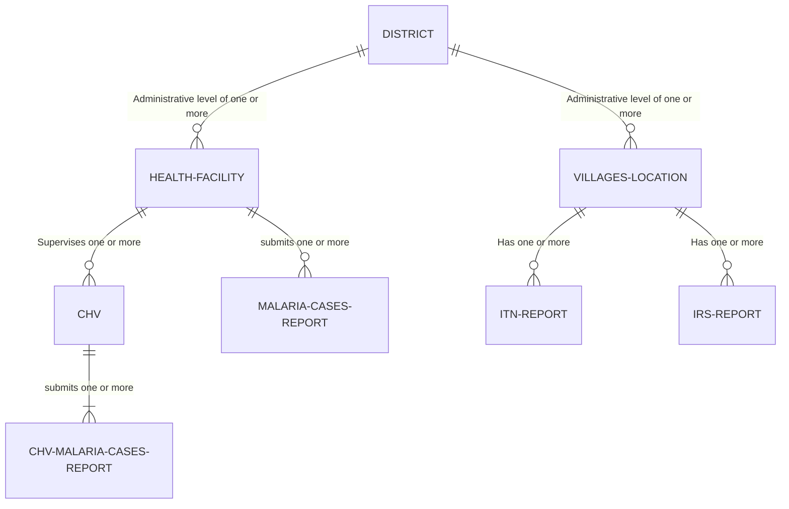

# Report staging

**Project:** Data assembly and cleaning Of NMCP Yemen and automating the workflow

## Report

### 1. Abstract

This report describes the process of consilidationg and mapping the data of National Malaria Control program into structured format the can be easily quired and analyzed

despite the differences in codes and names between the different datasets. The report discusses the challenges involved in each task and the strategies employed to address them. The report concludes with a summary of the findings and recommendations for future work.

We Will start By Defining the Available Data Sources and Activities. Then We will Go through the data review and cleaning process and provide the methods used and the result of Each reviewing iteration.

The Data cleaning and reviewing process will be automated (python code and other data integration and transformation tools) and manual by the team of this project.

Designing an integration pipe lines that merge data without repeating ourselves whenever we made changes to the Data. The Codes and Data Integration and Transformation Files are shared on the GitHub Page.

### objectives the project

The main objective is mapping all their activity data into a structured format for easy analysis. which will involve:

1. Creating the Dimension or Master Lists tables
dimension tables are frequently referenced entities that are referenced by the NMCP's activities data, Which include:

   - 2.1 Villages List Master Table.
   - 2.2 Health Facilities Merged Master List (HFs).
   - 2.3 Community Health Volunteers List (CHVs).

2. Review, Clean and merge the Data of each data source insuring they connect to the Masters List they are referencing.
3. Develop data visualization tools: Create dashboards and reports to visualize trends, analyze intervention effectiveness, and track progress towards malaria control goals.

The Final resulted Data mapping structure will have the following structure:



A structure which would enables us to:

- Have Easy and real time Access to data anytime about any entity when all activities and data collection are linked to this organizational hierarchy.
- Have a stored data about all entities NMCP involve with such as people, patients, beneficiaries of NMCP's different  activities... etc.
- Have a historical records of Personnel involved and in implementing NMCP activities, such as vector control of teams, data collectors, and educators ...etc. which will make it easier to analyzing their performances in all activities they are participating in.
- Easily Brows the summaries and historical data activities per entity (i.e access certain location historical data about ITNs distribution, breading sites, or any malaria relevant data to that locationm).
- Easily assess and improve intervention targeting, resource allocation, and program monitoring.

Project Data Processing Workflow (local and online database, for collaboration between this project team and to manage and test any new edits to the data before merging to the production database)

    Work flow chart Will be here

### 1 Defining Activities and Data sources

Some NMCP activities Data was submitted using the unique codes of the master entity in the master list which make them easy to map, but there are activities that were collected not using the code of the Subjects (Village code, Health Facility code) on those master lists.

Most of these activities are done directly by NMCP staff per targeted entity (location/health facility...etc). These Activities are done periodically in a mass campaign that is planned and executed in a specific span of time (i.e 6 days, 11 days).

#### 1.1 Insecticide Treated Nets (ITNs) Data

ITNs Distribution is done directly by NMCP per Location from house to house in a mass distribution campaign that takes a certain planned time i.e 6 days, 11 days...

```
later we need to add the issues the and more Outlining for this data source
```

#### 1.2 Indoor residual spraying (IRS) Data

IRS is done directly by NMCP per Location from house to house in a mass Spraying campaign for a population in multiple planned villages and it takes a certain planned time i.e 6 days, 11 days...

```
later we need to add the issues the and more Outlining for this data source
```

#### 1.3 Larval source management (LSM) Data

per Location done by regional Malaria Units in monthly in different villages withing the administration of the malaria unit.

```
later we need to add the issues the and more Outlining for this data source
```

#### 1.4 Supply of RDTs and AMD Data

Periodically supply Date of rapid diagnostic tests (RDTs) and antimalarial drugs (AMD) to Health facility warehouses so their health-facility care workers have sufficient stocks to diagnose and treat cases all year: done by nmcp staff in a mass camping targeting most Health Facilities in the country.

```
later we need to add the issues the and more Outlining for this data source
```

#### 1.1 community health Volunteers (CHVs) Data

Engaging CHVs to promote adoption of preventive measures, and diagnose and treat cases in remote Areas. CHVs submit their data of Malaria cases diagnoses treatment and education session monthly. we have data of 3 years we need to work on in this mapping project.

```
later we need to add the issues the and more Outlining for this data source
```

#### 1.1 Malaria Cases Data

from health facilities (HFs) are submitted on weekly basis per HF

Outline the specific data sources you will be usingL, This helps readers understand the limitations and strengths of your analysis

```
later we need to add the issues the and more Outlining for this data source
```

### 2 Creating the Dimension tables or The Master Lists

dimension tables are frequently referenced entities that are referenced by the NMCP's activities data, Which include:
  
#### 2.1 Villages List Master Table

Provided by External Country Geographic Office

#### 2.2 Health Facilities Merged Master List (HFs)

After creating it, we need to map each HF to its catchment Area in the Villages list.

#### 2.3 Community Health Volunteers List (CHVs)

After Creating the list each CHV needs to be mapped to her village in the villages list.

### 2 Review, Clean and merge

Review, Clean and merge of the Data insuring they connect to the Masters List they are referencing.

Each Data Source reviewing process is done in iteration with each iteration having it's result summary. The reviewing process may be through code and integration code and further reviewed manually for what can't be done in code.

#### 2.1 Review of ITNs Data

#### 2.2 Review of IRS Data

#### 2.3 Review of Malaria Cases Data

Merging Malaria Cases Data 2011-2016 of the old System with the data of 2017 and upward

#### 2.4 Review of CHVs Data

#### 2.5 Review of Larval source management Data

## Random Notes

---

Surveillance Systems:
Routine Health Information System
Sentinel Site Surveillance

Hfs without Owner Public/Private

**From UNIT I -Data and Data Collection.ppt**

Key Factors for High Quality Experimental

- Data should not be contaminated by poor measurement or errors in procedure.

- Eliminate confounding variables from study or minimize effects on variables.
- Representativeness: Does your sample represent the population you are studying? Must use random sample techniques.

how data is acquired, saved, distributed, and analyzed. To benefit from the data
optimally

**Workflow:**

- Establish the necessary databases, tools, and platforms for data processing.
- Automated Integration: Utilize automated tools (e.g., Python scripts, ETL processes) to integrate data into a unified format.
- How would the metadata catalog specifying the characteristics of each dataset look like
- Establish a feedback mechanism for continuous improvement.
- Schedule regular reporting cycles to analyze data trends and performance
- Metadata Catalog:
Create a metadata catalog specifying the characteristics of each dataset.
