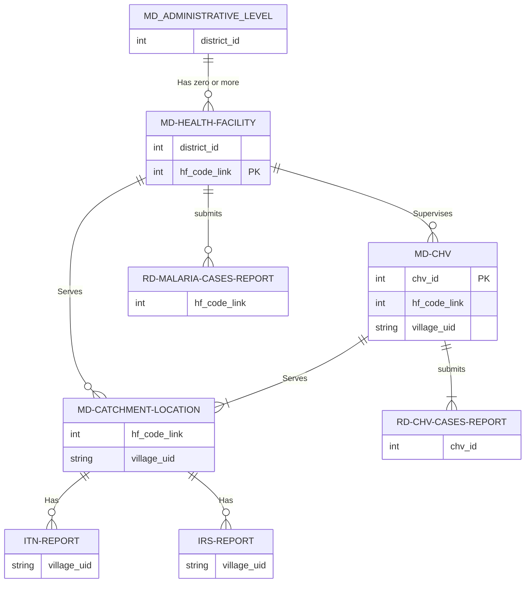

# NMCP Yemen Data Mappaing Docs

## Shared Folder Layout

      ├───master-data\
      │       md_catchment_locations.csv
      │       md_chvs.csv
      │       md_districts.csv
      │       Updated md_health_facilities_south_north_column_.xlsx
      │
      ├───old-data-deprecated\ # deprecated data files
      ├───other-data\
      └───routine-data\
      |   amd_movement_summary_act_consumption_shared.xlsx
      │   rd_chvs_monthly_data.csv
      │   rd_hfs_malaria_cases_2011_2023.csv
      │   rd_irs_data.csv
      │   rd_itns_data.csv
      │
      └───entomology\
            │   larval and adults exploration and investigation.xlsx
            │
            └───Insecticide Resistance\
                  Insecticide Resistance Monitoring Summaries.xlsx

## Final Status oF the Shared Data

as of **June, 24 2023** before our last meeting, nothing changed, the documentation may keep changing, the shared data will stay the same unless requested to change something.

### Mapping status

The following table shows NORTH/SOUTH Health Facilities that have some data in the north files and needs either be mapped to catchments localities or locate their GPS coordinate:

{==:white_check_mark: Final Health Facilities Mapping & GPS status==}

| **hf_owner** | **-** | **WITH NO CATCHMENTS** | **WITH NO CATCHMENT & GPS** | **WITH NO GPS** |
| ------------ | :---: | ---------------------- | --------------------------- | --------------- |
| **OTHER**    |  292  |                        |                             |                 |
| **PRIVATE**  |  574  |                        |                             | 111             |
| **PUBLIC**   | 4692  | 848                    | 291                         | 1               |

There are currently {--118234--} {++120982++} locations in total, of which {--105855: 89%--} {++110898: 91%++} have been mapped to a **health facility** in the `md_health_facilities.csv` master file.

{==:white_check_mark: Final CMs Mapping status==}

| **S/N**     | **gov_id** | **gov**          |                 **%**                 | **MAPPED** | **UNMAPPED** |
| ----------- | :--------: | ---------------- | :-----------------------------------: | :--------: | :----------: |
| NORTH       |     11     | Ibb              |  |   16497    |              |
| NORTH       |     17     | Hajjah           |  |   14416    |              |
| NORTH       |     20     | Dhamar           |  |   14219    |              |
| NORTH/SOUTH |     18     | Al Hudaydah      |  |    9508    |              |
| NORTH       |     23     | Sana'a           |  |    7504    |      1       |
| NORTH       |     22     | Sa'ada           |  |    6992    |              |
| NORTH       |     31     | Raymah           |  |    6766    |              |
| NORTH       |     29     | Amran            |  |    6421    |              |
| NORTH       |     16     | Al Jawf          |  |    2650    |              |
| NORTH       |     27     | Al Mahwit        |  |    4788    |      29      |
| NORTH/SOUTH |     26     | Marib            |  |    2181    |     213      |
| NORTH       |     13     | Amanat Al Asimah |  |    5736    |     773      |
| NORTH/SOUTH |     15     | Taizz            |  |    9574    |     9068     |
| NORTH/SOUTH |     14     | Al Bayda         |  |    3646    |              |

### Join status between reports and catchments

### ITNs Reports `rd_itns_data.csv` --> `md_catchment_locations.csv`

{==:white_check_mark: Final ITN's Records Mapping status ==}

| Total             | linked   | unlinked (IDPs Camps)     | unlinked Other   |
| ----------------- | :------: | :-----------------------: | :--------------: |
| 50735 **records** | 49806    | 155                       | 774              |

### IRS Reports `rd_irs_data.csv` --> `md_catchment_locations.csv`

{== :white_check_mark: Final IRS Records Mapping status ==}

{++ After IRS 2022 data was Included ++}

| Total             | linked   | unlinked (IDPs Camps)  | unlinked Other |
| ----------------- | :------: | :--------------------: | :------------:|
| 41108 **records** | 39791    | 154                    | 1163           |

### :material-file-excel-box-outline: AMD Consumption `amd_movement_summary_act_consumption_shared.xlsx`

The consumption periods between 2019 and 2022 are consecutive and have no gaps. They are more reliable in the major health facilities than the cases routine data. Occasionally, there may be instances where the number of cases exceeds the amount of consumption, which may be due to a shortage of supplies. Although this occurs infrequently, I have not included this information in order to avoid cluttering the main report. The majority of the reports are from the most critical areas where malaria is prevalent. If necessary, I can include this information and modify the structure of the report as per request.

- `gov_id`
- `district_id_nmcp`
- `district_en`
- `hf_name`
- `hf_code_link`
- `consumed_ACT`
- `consumption_from_week` : Start of consumption period.
- `consumption_to_week` End of consumption period.
- `total_confirmed_cases` Total reported confirmed cases in the routine data within the same consumption period summed up from the available reports in routine data.
- `available_cases_data_in_eidews_from_week` Start of available routine data period. If it starts later than the start of consumption period the difference is missing weeks in routine data.
- `available_cases_data_in_eidews_to_week` End of available routine data period. If it ends earlier than the end of consumption period the difference is missing weeks in routine data
- `hf_has_catchment_localities` `1` If the hf has a catchment in the catchment file, `blank` or `0` if it has no catchment.

### Entomology data

There are more data collected from the field, needs to be organized and linked to each other.

## Entities Relationships Diagram

Relations between entities in the data files.

!!! note ""

    Only the fields participating in a relationship from each side are included in each diagram.

## :material-folder: metadata-master-lists Folder

Files in this folder contain the entities to which all the routine data can be linked using the IDs, an entity in its file is uniquely identified by the ID with no duplication except for the `md_catchment_locations.csv` master file.

!!! info ""

    In Order for the Arabic letters to display correctly CSV files need to be imported in `UTF-8` unicode.

### :fontawesome-solid-file-csv: Districts File `md_districts.csv`

Administrative boundary datasets for levels 1, 2 (governorate, and district) for Yemen south and north, all master and routine data files have been unified to fully link to this file using the IDs `gov_id` or `district_id_unified_s_n`. The `district_id_nmcp` is the one used to link to the district level in shared shape file.

- `gov_id` **ID of the Governorate**, uniquely identified by this id.
- `district_id_nmcp` **Shape's file ID of the District** shared in with shape file.
- `district_id_unified_s_n` **ID of the District used in south** Used in the south data. Introduced lately to data files too.
- `gov_ar` **Ar name of the Governorate** to display correctly -> UTF-8.
- `district_ar` **Ar name of the District** to display correctly -> UTF-8.

### :fontawesome-solid-file-csv: Health Facilities File `md_health_facilities.csv`

- `gov_id`.
- `district_id_nmcp`.
- `district_id_unified_s_n`.
- `hf_code_link` **ID of the Health Facility** North data files code.
- {--`health_facility_uid` **UID of the Health Facility**--} Ignore it.
- `hf_name` to display correctly -> UTF-8, since we merged from multiple sources they contains names in different languages but each is unique.
- `hf_type`.
- `hf_owner`.
- `longitude`.
- `latitude`.
- `elevation`.

**Additional Fields `brought from other tables`**

- `catchments_count` Catchments localities count.
- `chvs_count` **Number of CHVs** belonging to this Health Facility if there are any.
- `chvs_confirmed_2018`, `chvs_confirmed_2019` ... `chvs_confirmed_2022` **Confirmed Malaria Cases** Yearly summary of malaria cases reported by the CHVs supervised by this HF.
- `hfs_confirmed_2013`, `hfs_confirmed_2019`, ..., `hfs_confirmed_2022` **HFs Confirmed Malaria Cases** Yearly summary of malaria cases reported by this Health Facility.
- `ACT_consumption_2020`, `ACT_consumption_2021` ... `ACT_consumption_2022`: will be calculated when AMD data is shared.
- `served_population_2022` served population in all levels of catchments localities.

!!! note ""

    Additional fields brought from other files, I just use them with other calculations (sometime other meaningless variables) to automatically verify changes or to quickly filter where we are actually active.

### :fontawesome-solid-file-csv: Catchment Localities File `md_catchment_locations.csv`

- `mapping_status` Indicates whether the location is mapped to a **health facility** in the `md_health_facilities.csv` master file or not, with `1` indicating a mapped location and a `blank` indicating an unmapped location.
- `gov_id` **ID of the Governorate**.
- `district_id_nmcp`.
- `district_id_unified_s_n`.
- `hf_code_link`: locations that are not mapped to a health facility in the north i.e. with `mapping_status = blank` have been given a temporary ID in the form of `district_id + 900 or >900`.
- `health_facility_uid`.
- `level` **Accessibility** level to the health facility, with `1` indicating the easiest accessibility and `3` the hardest.
- `urban_rural` **Urban** or **Rural**, old ids replaced by labels.
- `settlement` Type of location, such as village, subvillage, island, etc same as before.
- `pop2004` Population **2004**.
- `pop2022` Population **2022**.

### :fontawesome-solid-file-csv: CHVs File `md_chvs.csv`

- `chv_id`.
- `hf_code_link`.
- {--`health_facility_uid`--} ignore it.

## :material-folder: routine-data Folder

### :fontawesome-solid-file-csv: ITNs Data 2018 - 2022 `rd_itns_data.csv`

- `sn` in case it is needed to link any data related to this record later like IDPs Camps GPS.
- `year` Year planned.
- `started` Year-Month started.
- `village_uid`
- `day`
- `houses_2022` this variable were introduced to the data from 2022.
- `res` Residents.
- `idps`
- `pop_m` Male Population
- `pop_f` Female Population
- `less_5_m` < 5y Male
- `less_5_f` < 5y Female
- `preg_wmn` pregnant women
- `bnets` Bed nets distributed
- `Is IDPs Camp` `1` is an IDPs Camp, IDPs camps have a general code for all based on the district won't link to a catchment locality currently but we will look into it and specify within what catchment locality later.

### :fontawesome-solid-file-csv: IRS Data `rd_irs_data.csv`

- `sn` in case it is needed to link any data related to this record later like IDPs Camps GPS.
- `year` Year planned.
- `started` Year-Month started.
- `village_uid`.
  ...
- `Is IDPs Camp` `1` is an IDPs Camp, IDPs camps have a general code for all based on the district won't link to a catchment locality currently but we will look into it and specify within what catchment area later.

|                    |     **2019**     |     **2020**     |     **2022**     |                                    |
|--------------------|:----------------:|:----------------:|:----------------:|------------------------------------|
| Population         | :material-check: | :material-check: | :material-check: |                                    |
| House Hold         | :material-check: | :material-check: | :material-check: |                                    |
| Houses sprayed     | :material-check: | :material-check: | :material-check: | = `Full spray` + `Partial spray`   |
| Houses non-sprayed | :material-check: | :material-check: | :material-check: | = `Closed` + `Refused`             |
| Total Houses       | :material-check: | :material-check: | :material-check: | = `sprayed` + `non-sprayed` houses |
| Full spray         | :material-check: | :material-check: |        :x:       |                                    |
| Partial spray      | :material-check: | :material-check: |        :x:       |                                    |
| Rooms sprayed      | :material-check: | :material-check: | :material-check: |                                    |
| Rooms non-sprayed  | :material-check: | :material-check: | :material-check: |                                    |
| Total No of rooms  | :material-check: | :material-check: | :material-check: |                                    |
| No. of workers     | :material-check: | :material-check: |        :x:       |                                    |
| Closed             | :material-check: | :material-check: | :material-check: |                                    |
| Refused            | :material-check: | :material-check: | :material-check: |                                    |
