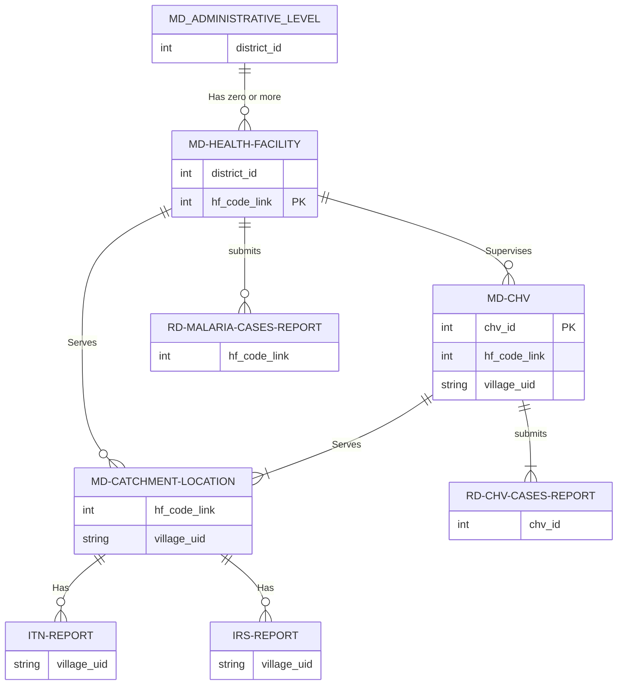

# NMCP Yemen Data Mappaing Docs

Project documentation.

## Shared Folder Layout

    +---metadata-master-lists\
    |       md_catchment_locations.csv
    |       md_chvs.csv
    |       md_districts.csv
    |       md_health_facilities.csv
    |
    +---other-data\
    +---routine-data\
        +---entomology\
        +---malaria_cases\
                rd_hfs_malaria_cases_2011_2023.csv
                rd_chvs_monthly_data.csv
                rd_amd_movement_data.csv
                rd_itns_data.csv
                rd_irs_data.csv

## Entities Relationships Diagram

Relations between entities in the data files.

!!! note ""

    Only the fields participating in a relationship from each side are included in each diagram.

## :material-folder: metadata-master-lists Folder

Files in this folder contain the entities to which all the routine data can be linked using the IDs, an entity in its file is uniquely identified by the ID with no duplication except for the `md_catchment_locations.csv` master file.

### :fontawesome-solid-file-csv: Districts File `md_districts.csv`

Administrative boundary datasets for levels 1, 2 (governorate, and district) for Yemen south and north, all master and routine data files have been unified to fully link to this file using the IDs `gov_id` or `district_id_who_and_south`.

???+ note "Fields"

    - `gov_id` **ID of the Governorate**, uniquely identified by this id.
    - `district_id_who_and_south` **ID of the District** unified with the shape file and it's the one currently used by the south, the old id has been removed to avoid confusion when merging with the south data, it had some errors that have been fixed.
    - `gov_en` **En name of the Governorate**.
    - `gov_ar` **Ar name of the Governorate**.
    - `district_en` **En name of the District**.
    - `district_ar` **Ar name of the District**.

### :fontawesome-solid-file-csv: Health Facilities File `md_health_facilities.csv`

???+ note "Main Fields"
    - `gov_id` **ID of the Governorate**.
    - `district_id_who_and_south` **ID of the District**.
    - `hf_code_link` **ID of the Health Facility**

      ==I brought it to the data because it is being used by the south in their data, despite the fact that it had several issues in the north that needed to be addressed to facilitate the merging process. However, during the process of integration, we discovered that some of the codes were not consistent with the current south IDs, and there were instances where the codes overlapped with other codes that were pointing to a routine data of something else, we flagged where they are *Ammar is working on this*. The main challenge we face in connecting to the south data is the presence of empty codes. These codes are associated with routine data from 2011-2019 in our system but they are still not mentioneded anywhere in the south, and they are a lot, Ammar is working on this too, We also have a similar issue in the north, but it affects only a few facilities and is unlikely to significantly impact the overall results, will update this later.==

    - `hf_name` **Name of the Health Facility**
    - `hf_type` **Type of the Health Facility**, CENTER, UNIT, HOSPITAL, CLINIC, DISPENSARY, Lab, COMPLEX, OTHER.
    - `hf_owner` PUBLIC, and PRIVATE
    - `longitude`
    - `latitude`

??? note "Additional Fields `brought from other tables`"

    Additional fields brought from other files, CHVs Confirmed Cases brought from Chvs' Monthly routine data in rd_chv_reports.csv, HF Confirmed Cases are from the Health Facility routine data in rd_hfs_malaria_cases_2011_2023.csv, and HF ACT Consumption is from the AMD routine data in rd_amd_movement_data.csv, these summaries have no effect on the uniquness of the Health facility in this list.

    - `chvs_count` **Number of CHVs** belonging to this Health Facility if there are any.
    - `chvs_confirmed_2018`, `chvs_confirmed_2019` ... `chvs_confirmed_2022` **Confirmed Malaria Cases** Yealy summary of malaria cases reported by the CHVs supervised by this HF.
    - `hf_confirmed_2013`, `hf_confirmed_2019`, ..., `hf_confirmed_2022` **HFs Confirmed Malaria Cases** Yealy summary of malaria cases reported by this Health Facility.
    - `ACT_consumed_2019`, `ACT_consumed_2020` ... `ACT_consumed_2019`

### :fontawesome-solid-file-csv: Catchment Localities File `md_catchment_locations.csv`

???+ note "Main Fields"

    - `mapping_status` Indicates whether the location is mapped to a **health facility** in the `md_health_facilities.csv` master file or not, with `1` indicating a mapped location and a `blank` indicating an unmapped location.
    - `gov_id` **ID of the Governorate**.
    - `district_id_who_south` **ID of the District**.
    - `hf_code_link`: **ID of the Health Facility**, locations that are not mapped to a health facility in the north i.e. with `mapping_status = blank` have been given a temporary ID in the form of `district_id + 900 or >900`.
    - `level` **Accessibility** level to the health facility, with `1` indicating the easiest accessibility and `3` the hardest.
    - `urban_rural` **Urban** or **Rural**, old ids replaced by lables.
    - `settlement` Type of location, such as village, subvillage, island, etc same as before.
    - `pop2004` Population **2004**.
    - `pop2022` Population **2022**.

### :fontawesome-solid-file-csv: CHVs File `md_chvs.csv`

???+ note "Main Fields"

    - `chv_id`.
    - `hf_code_link`.
    - `gov_id`.
    - `district_id_who_south`.

**Locations Mapping status per governorate:**

There are currently `118234` locations in total, of which `105855: 89%` have been mapped to a **health facility** in the `md_health_facilities.csv` master file. The remaining `12379` locations are currently unmapped, either because there is a reason for not mapping them yet or because the mapping is considered a work in progress.

| S/N   | gov_id | gov_en           |                   %                    | MAPPED | UNMAPPED |
| ----- | :----: | ---------------- | :------------------------------------: | :----: | :------: |
| North |   11   | Ibb              |  | 13763  |          |
| North |   13   | Amanat Al Asimah |    |  5736  |   773    |
| North |   14   | Al Bayda         |  |  3646  |          |
| North |   15   | Taizz            |    |  8578  |  10064   |
| North |   16   | Al Jawf          |  |  2636  |          |
| North |   17   | Hajjah           |  | 14416  |          |
| North |   18   | Al Hudaydah      |  |  9508  |          |
| North |   20   | Dhamar           |  | 14219  |          |
| North |   22   | Sa'ada           |  |  6992  |          |
| North |   23   | Sana'a           |  |  7504  |    1     |
| North |   26   | Marib            |    |  882   |   1512   |
| North |   27   | Al Mahwit        |    |  4788  |    29    |
| North |   29   | Amran            |  |  6421  |          |
| North |   31   | Raymah           |  |  6766  |          |
