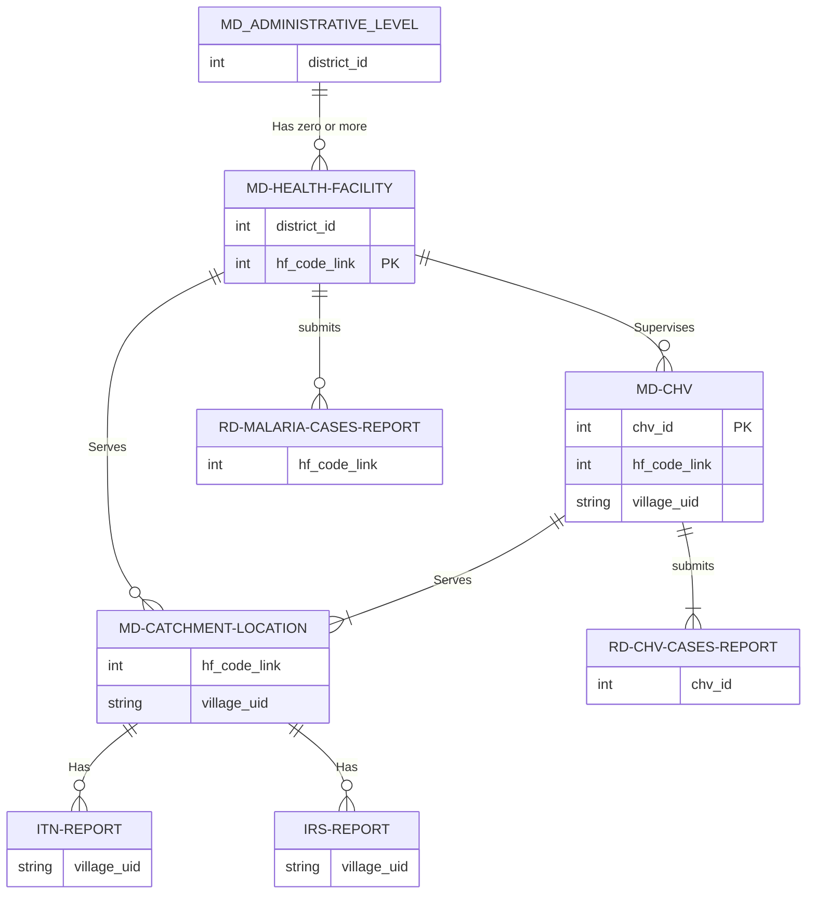

# NMCP Yemen Data Mappaing Docs

Project documentation.

## Shared Folder Layout

    +---metadata-master-lists\
    |       md_catchment_locations.csv
    |       md_chvs.csv
    |       md_districts.csv
    |       md_health_facilities.csv
    |
    +---other-data\
    +---routine-data\
        +---entomology\

        rd_hfs_malaria_cases_2011_2023.csv
        rd_chvs_monthly_data.csv
        rd_amd_movement_data.csv
        rd_itns_data.csv
        rd_irs_data.csv

## Entities Relationships Diagram

Relations between entities in the data files.

!!! note ""

    Only the fields participating in a relationship from each side are included in each diagram.

## :material-folder: metadata-master-lists Folder

Files in this folder contain the entities to which all the routine data can be linked using the IDs, an entity in its file is uniquely identified by the ID with no duplication except for the `md_catchment_locations.csv` master file.

!!! info ""

    In Order for the Arabic letters to display correctly CSV files need to be imported in `UTF-8` unicode.

### :fontawesome-solid-file-csv: Districts File `md_districts.csv`

Administrative boundary datasets for levels 1, 2 (governorate, and district) for Yemen south and north, all master and routine data files have been unified to fully link to this file using the IDs `gov_id` or `district_id_who_and_south`.

- `gov_id` **ID of the Governorate**, uniquely identified by this id.
- `district_id_nmcp` **ID of the District** shared in with shape file.
- `district_id_unified_s_n` **ID of the District** Used in the south data. Introduced lately to data files too.
- `gov_en` **En name of the Governorate**.
- `gov_ar` **Ar name of the Governorate** to display correctly -> UTF-8.
- `district_en` **En name of the District**.
- `district_ar` **Ar name of the District** to display correctly -> UTF-8.

### :fontawesome-solid-file-csv: Health Facilities File `md_health_facilities.csv`

- `gov_id`.
- `district_id_nmcp`.
- `district_id_unified_s_n`.
- `hf_code_link`.
- `health_facility_uid` The old shared UID.
- `hf_name` to display correctly -> UTF-8.
- `hf_type`.
- `hf_owner`.
- `longitude`.
- `latitude`.
- `elevation`.

**Additional Fields `brought from other tables`**

- `catchments_count` Catchments localities count.
- `chvs_count` **Number of CHVs** belonging to this Health Facility if there are any.
- `chvs_confirmed_2018`, `chvs_confirmed_2019` ... `chvs_confirmed_2022` **Confirmed Malaria Cases** Yealy summary of malaria cases reported by the CHVs supervised by this HF.
- `hfs_confirmed_2013`, `hfs_confirmed_2019`, ..., `hfs_confirmed_2022` **HFs Confirmed Malaria Cases** Yealy summary of malaria cases reported by this Health Facility.
- `ACT_consumption_2020`, `ACT_consumption_2021` ... `ACT_consumption_2022`: will be calculated when AMD data is shared.

!!! note ""

    Additional fields brought from other files, CHVs Confirmed Cases brought from Chvs' Monthly routine data in rd_chv_reports.csv, HF Confirmed Cases are from the Health Facility routine data in rd_hfs_malaria_cases_2011_2023.csv, and HF ACT Consumption is from the AMD routine data in rd_amd_movement_data.csv, these summaries have no effect on the uniquness of the Health facility in this list.

### :fontawesome-solid-file-csv: Catchment Localities File `md_catchment_locations.csv`

- `mapping_status` Indicates whether the location is mapped to a **health facility** in the `md_health_facilities.csv` master file or not, with `1` indicating a mapped location and a `blank` indicating an unmapped location.
- `gov_id` **ID of the Governorate**.
- `district_id_who_south`.
- `hf_code_link`: **ID of the Health Facility**, locations that are not mapped to a health facility in the north i.e. with `mapping_status = blank` have been given a temporary ID in the form of `district_id + 900 or >900`.
- `level` **Accessibility** level to the health facility, with `1` indicating the easiest accessibility and `3` the hardest.
- `urban_rural` **Urban** or **Rural**, old ids replaced by lables.
- `settlement` Type of location, such as village, subvillage, island, etc same as before.
- `pop2004` Population **2004**.
- `pop2022` Population **2022**.

### :fontawesome-solid-file-csv: CHVs File `md_chvs.csv`

- `chv_id`.
- `hf_code_link`.

## :material-folder: routine-data Folder

### :fontawesome-solid-file-csv: ITNs Data 2018 - 2022 `rd_itns_data.csv`

ITNs and IRS data where shared this time in the `day` unit, at which day so we can link any other related data to it easly if needed later like IDPs camps GPS and the populated locations that do not link to a particular catchment location in the catchment file, I introduced the `sn` column, this is the unique ID of the record that might be used to share any related data later.

- `sn` in case it is needed to link any data related to this record later like IDPs Camps GPS.
- `year` Year excution started
- `execution_started` Month excution started
- `target_type` `1` is a planned location, `blank` or `zero` is eithr an IDPs camp, or other unplanned populated location, *it needs more review*.
- `village_uid`
- `district_id_nmcp`
- `day_of_execution`
- `houses_2022` this variable were introduced to the data from 2022.
- `res` Residents.
- `idps`
- `pop_m` Male Population
- `pop_f` Female Population
- `less_5_m` < 5y Male
- `less_5_f` < 5y Female
- `preg_wmn` pregnant women
- `bnets` Bed ntes distributed
- `Is IDPs Camp` `1` is an IDPs Camp, IDPs camps don't have codes to be linked to a catchment locality but we will look into it and specify within what catchment area later.
- `status_of_coverage` Was this location fully covered or partially due to a reason, *Last Answer of the team leader in last data submission date*.
- `reason` If partaily covered what was the reason, *Last Answer of the team leader in the last data submission date*.

### :fontawesome-solid-file-csv: IRS Data `rd_irs_data.csv`

- `sn` in case it is needed to link any data related to this record later like IDPs Camps GPS.
- `year` Year excution started
- `execution_started` Month excution started
- `target_type` `1` is a planned location, `blank` or `zero` is eithr an IDPs camp, or other unplanned populated location, *it needs more review*.
...
- `Is IDPs Camp` `1` is an IDPs Camp.
- `status_of_coverage` Was this location fully covered or partially due to a reason, *Last Answer of the team leader in last data submission date*.
- `reason` If partaily covered what was the reason, *Last Answer of the team leader in the last data submission date*.

## Current Status oF the Shared Data

### Mapping status

NORTH/SOUTH Health Facilities that have data and needs either be mapped to catchments localities or locate their GPS coordinate:

| **hf_owner** | **-** | **WITH NO CATCHMENTS** | **WITH NO CATCHMENT & GPS** | **WITH NO GPS** |
|--------------|:-----:|------------------------|-----------------------------|-----------------|
| **OTHER**    |  292  |                        |                             |                 |
| **PRIVATE**  |  574  |                        |                             |       111       |
| **PUBLIC**   |  4692 |           848          |             291             |        1        |

There are currently {--118234--} {++120982++} locations in total, of which {--105855: 89%--} {++110898: 91%++} have been mapped to a **health facility** in the `md_health_facilities.csv` master file.

| **S/N**     | **gov_id** | **gov**          |                 **%**                 | **MAPPED** | **UNMAPPED** |
|-------------|:----------:|------------------|:-------------------------------------:|:----------:|:------------:|
| NORTH       |     11     | Ibb              |  |    16497   |              |
| NORTH       |     17     | Hajjah           |  |    14416   |              |
| NORTH       |     20     | Dhamar           |  |    14219   |              |
| NORTH/SOUTH |     18     | Al Hudaydah      |  |    9508    |              |
| NORTH       |     23     | Sana'a           |  |    7504    |       1      |
| NORTH       |     22     | Sa'ada           |  |    6992    |              |
| NORTH       |     31     | Raymah           |  |    6766    |              |
| NORTH       |     29     | Amran            |  |    6421    |              |
| NORTH       |     16     | Al Jawf          |  |    2650    |              |
| NORTH       |     27     | Al Mahwit        |  |    4788    |      29      |
| NORTH/SOUTH |     26     | Marib            |  |    2181    |      213     |
| NORTH       |     13     | Amanat Al Asimah |  |    5736    |      773     |
| NORTH/SOUTH |     15     | Taizz            |  |    9574    |     9068     |
| NORTH/SOUTH |     14     | Al Bayda         |  |    3646    |              |
| SOUTH       |     12     | Abyan            |                                       |            |              |
| SOUTH       |     19     | Hadramaut        |                                       |            |              |
| SOUTH       |     21     | Shabwah          |                                       |            |              |
| SOUTH       |     24     | Aden             |                                       |            |              |
| SOUTH       |     25     | Lahj             |                                       |            |              |
| SOUTH       |     28     | Al Maharah       |                                       |            |              |
| SOUTH       |     30     | Al Dhale'e       |                                       |            |              |
| SOUTH       |     32     | Socotra          |                                       |            |              |

### Rutine Data Status

### Notes on AMD Consumption data that I am working on currenly
